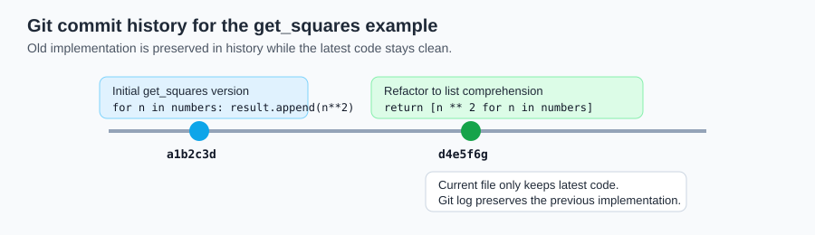
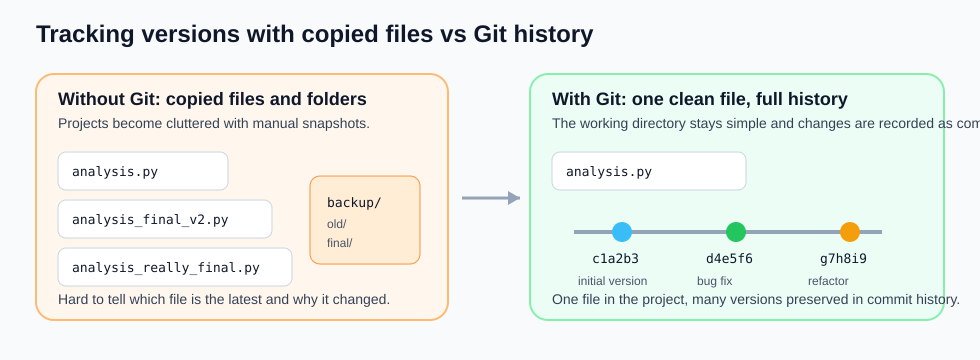
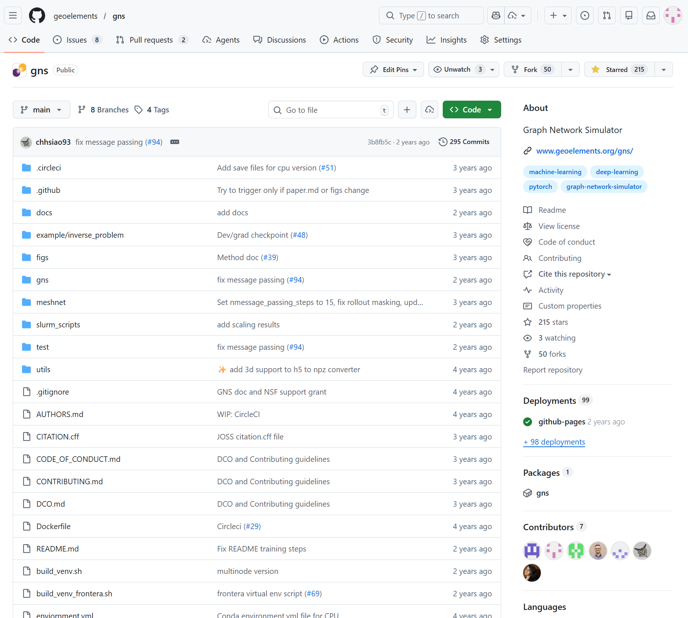
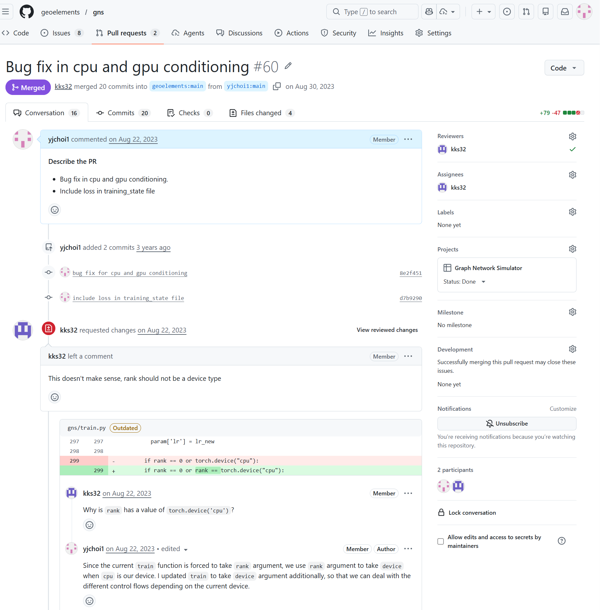
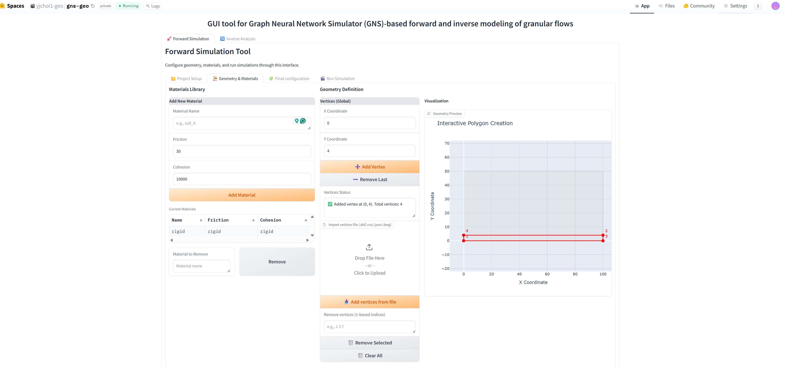

## What is DevOps?
DevOps is a methodological framework that integrates software development and IT operations. By leveraging automation, collaborative cultures, and consistent environments, DevOps enables teams to build, test, and deploy high-quality software with increased velocity and reliability.

Typical DevOps tools include:

* Version control systems (e.g., Git)
* Collaboratino, continuous integration/continuous deployment (CI/CD) platforms (e.g., GitHub, GitLab)
* Containerization tools (e.g., Docker)
* Container orchestration platforms (e.g., Kubernetes)


## Why we need DevOps?

### Version control keeps code history clean

Instead of copying files like `analysis_final_v2.py` or commenting out old code, we can track changes properly with Git and return to earlier versions when needed. For example:


* Messy commented out old code lines:
```python
def get_squares(numbers):
    # old version
    # result = []
    # for n in numbers:
    #     result.append(n ** 2)
    # return result

    # new version
    return [n ** 2 for n in numbers]
```

* With Git, we keep only the latest version, but still preserve the previous one through commit history:
```python
def get_squares(numbers):
    return [n ** 2 for n in numbers]
```


* Likewise, no need to create multiple files or folders to track code versions. Commit history tracks this.



### Remote repository and collaboration

* An example for remote repository 



* Collaboration with github pull request (PR)
Example of PR: [https://github.com/geoelements/gns/pull/67](https://github.com/geoelements/gns/pull/67)



### Remote deployment

* Deploy your website to GitHub Pages using GitHub Action. [Example](https://cbgeopy.readthedocs.io/en/latest/index.html)


* Deploy your ML application to Hugging Face Spaces. 



### Testing and CI/CD catch problems early
Automated checks help us verify that code still works before it is merged or deployed, which is much safer than testing everything manually at the end.


### Machine-agnostic development avoids "works on my machine" issues
With consistent environments such as containers, the same code can run more predictably across laptops, servers, and cloud machines.

### Machine-agnostic deployment improves reproducibility
If development and deployment environments are consistent, it becomes much easier to move a project from local testing to remote execution without unexpected failures.
