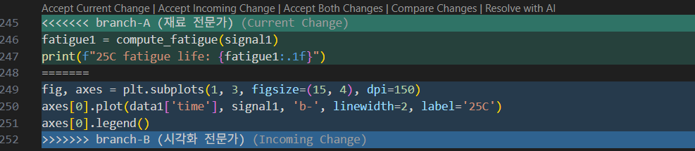

# Example: MLP Training Pipeline

In deep learning code, data, models, training, and visualization are deeply intertwined, maximizing the benefits of modularization.

---

## Monolithic Script

Data generation, model definition, training loop, evaluation, and visualization are all hardcoded in a single file.

```python title="train.py"
import torch
import torch.nn as nn
import matplotlib.pyplot as plt

# Hardcoded settings
N, D, EPOCHS, LR = 1000, 10, 100, 1e-3

X = torch.randn(N, D)
y = (X.sum(dim=1) > 0).float()
X_train, X_test = X[:800], X[800:]
y_train, y_test = y[:800], y[800:]

model = nn.Sequential(
    nn.Linear(D, 64), nn.ReLU(),
    nn.Linear(64, 1), nn.Sigmoid()
)
optimizer = torch.optim.Adam(model.parameters(), lr=LR)
criterion = nn.BCELoss()

losses = []
for epoch in range(EPOCHS):
    pred = model(X_train).squeeze()
    loss = criterion(pred, y_train)
    optimizer.zero_grad()
    loss.backward()
    optimizer.step()
    losses.append(loss.item())

with torch.no_grad():
    acc = ((model(X_test).squeeze() > 0.5) == y_test).float().mean()
    print(f"Accuracy: {acc:.3f}")

plt.plot(losses)
plt.savefig('loss.png')
plt.show()
```

!!! warning "Problems"
    - Want to change `hidden_dim`? → Must open and modify the code.
    - Want to change `lr`? → Must open and modify the code.
    - Want to change model architecture? → Must modify the training code as well.
    - Where are experimental conditions recorded? → Nowhere.

---

## Modular Code

### Project Structure

```text title="ml_project/"
ml_project/
├── config.json      ← Experiment settings (I/O separation)
├── dataset.py       ← Data loading
├── model.py         ← Model definition
├── trainer.py       ← Training/evaluation logic
├── visualizer.py    ← Visualization
└── main.py          ← Executes train(cfg)
```

### Separating I/O with `config`

```json title="config.json"
{
  "data": {
    "n_samples": 1000,
    "n_features": 10,
    "train_ratio": 0.8
  },
  "model": {
    "hidden_dim": 64
  },
  "train": {
    "epochs": 100,
    "lr": 0.001
  },
  "output": {
    "save_path": "loss.png"
  }
}
```

### Code for Data Handling

```python title="dataset.py"
import torch


class ExperimentDataset:
    def __init__(self, n_samples, n_features, train_ratio=0.8):
        X = torch.randn(n_samples, n_features)
        y = (X.sum(dim=1) > 0).float()
        split = int(n_samples * train_ratio)
        self.X_train, self.X_test = X[:split], X[split:]
        self.y_train, self.y_test = y[:split], y[split:]
```

### Code for Model Architecture

```python title="model.py"
import torch.nn as nn


class MLP(nn.Module):
    def __init__(self, input_dim, hidden_dim=64):
        super().__init__()
        self.net = nn.Sequential(
            nn.Linear(input_dim, hidden_dim), nn.ReLU(),
            nn.Linear(hidden_dim, 1), nn.Sigmoid()
        )

    def forward(self, x):
        return self.net(x)
```

### Code for Training/Evaluation Logic

```python title="trainer.py"
import torch


class Trainer:
    def __init__(self, model, lr=1e-3):
        self.model = model
        self.optimizer = torch.optim.Adam(model.parameters(), lr=lr)
        self.criterion = torch.nn.BCELoss()
        self.losses = []

    def train(self, X, y, epochs=100):
        for _ in range(epochs):
            pred = self.model(X).squeeze()
            loss = self.criterion(pred, y)
            self.optimizer.zero_grad()
            loss.backward()
            self.optimizer.step()
            self.losses.append(loss.item())

    def evaluate(self, X, y):
        with torch.no_grad():
            return ((self.model(X).squeeze() > 0.5) == y).float().mean().item()
```

### Code Dedicated to Visualization

```python title="visualizer.py"
import matplotlib.pyplot as plt


def plot_loss(losses, save_path=None):
    plt.plot(losses)
    plt.xlabel('Epoch')
    plt.ylabel('Loss')
    plt.title('Training Loss')
    if save_path:
        plt.savefig(save_path)
    plt.show()
```

### Entrypoint: `main.py`

```python title="main.py"
import json
from dataset import ExperimentDataset
from model import MLP
from trainer import Trainer
from visualizer import plot_loss


def train(cfg):
    data = ExperimentDataset(**cfg['data'])
    model = MLP(cfg['data']['n_features'], **cfg['model'])
    trainer = Trainer(model, lr=cfg['train']['lr'])

    trainer.train(data.X_train, data.y_train, epochs=cfg['train']['epochs'])
    print(f"Accuracy: {trainer.evaluate(data.X_test, data.y_test):.3f}")
    plot_loss(trainer.losses, save_path=cfg['output']['save_path'])


if __name__ == '__main__':
    with open('config.json') as f:
        cfg = json.load(f)
    train(cfg)
```

---

## Scenarios Highlighting the Benefits

### Changing Hyperparameters

=== "Original `config.json`"

    ```json title="config.json"
    {
      "data": {
        "n_samples": 1000,
        "n_features": 10,
        "train_ratio": 0.8
      },
      "model": {
        "hidden_dim": 64
      },
      "train": {
        "epochs": 100,
        "lr": 0.001
      },
      "output": {
        "save_path": "loss.png"
      }
    }
    ```

=== "After changes (`hidden_dim`, `lr`, `epochs`)"

    ```json title="config.json"
    {
      "data": {
        "n_samples": 1000,
        "n_features": 10,
        "train_ratio": 0.8
      },
      "model": {
        "hidden_dim": 128
      },
      "train": {
        "epochs": 200,
        "lr": 0.0001
      },
      "output": {
        "save_path": "loss.png"
      }
    }
    ```

=== "View as diff (changes only)"

    ```diff title="config.json"
        "model": {
    -     "hidden_dim": 64
    +     "hidden_dim": 128
        },
        "train": {
    -     "epochs": 100,
    -     "lr": 0.001
    +     "epochs": 200,
    +     "lr": 0.0001
        },
    ```

### Experiment Version Control

Creating `config_v1.json` and `config_v2.json` automatically records experimental conditions.

=== "`train(cfg_v1)`"

    ```python title="main.py (excerpt)"
    train(cfg_v1)  # hidden_dim=64, lr=0.001
    ```

=== "`train(cfg_v2)`"

    ```python title="main.py (excerpt)"
    train(cfg_v2)  # hidden_dim=128, lr=0.0001
    ```

### Replacing the Model


=== "Original `model.py` (2-layer MLP)"

    ```python title="model.py"
    class MLP(nn.Module):
        def __init__(self, input_dim, hidden_dim=64):
            super().__init__()
            self.net = nn.Sequential(
                nn.Linear(input_dim, hidden_dim), nn.ReLU(),
                nn.Linear(hidden_dim, 1), nn.Sigmoid()
            )

        def forward(self, x):
            return self.net(x)
    ```

=== "After adding a hidden layer"

    ```python title="model.py"
    class MLP(nn.Module):
        def __init__(self, input_dim, hidden_dim=64):
            super().__init__()
            self.net = nn.Sequential(
                nn.Linear(input_dim, hidden_dim), nn.ReLU(),
                nn.Linear(hidden_dim, hidden_dim), nn.ReLU(),  # Added layer
                nn.Linear(hidden_dim, 1), nn.Sigmoid()
            )

        def forward(self, x):
            return self.net(x)
    ```

=== "View as diff (changes only)"

    ```diff title="model.py"
          self.net = nn.Sequential(
              nn.Linear(input_dim, hidden_dim), nn.ReLU(),
    +         nn.Linear(hidden_dim, hidden_dim), nn.ReLU(),  # Added layer
              nn.Linear(hidden_dim, 1), nn.Sigmoid()
          )
    ```

### Version Control: Tracking Changes with `git diff`


**Monolithic Script:**

```diff title="git diff: train.py"
--- a/train.py
+++ b/train.py
@@ ... Must find what changed in a single 30-line file ...
  model = nn.Sequential(
      nn.Linear(D, 64), nn.ReLU(),
+     nn.Linear(64, 64), nn.ReLU(),
      nn.Linear(64, 1), nn.Sigmoid()
  )
```


**Modular Code**: The changed file itself indicates the intention.

```diff title="git diff: model.py"
--- a/model.py
+++ b/model.py
  self.net = nn.Sequential(
      nn.Linear(input_dim, hidden_dim), nn.ReLU(),
+     nn.Linear(hidden_dim, hidden_dim), nn.ReLU(),
      nn.Linear(hidden_dim, 1), nn.Sigmoid()
  )
```


### Collaboration: Modifying Different Files, Minimizing Merge Conflicts

Two people working simultaneously:

- **A (ML Engineer)**: Adds Dropout to the model.
- **B (Data Engineer)**: Adds normalization to data loading.

**Monolithic Script:** Both modify the single `train.py` file. A changes the model definition, and B changes the data preprocessing/splitting **right above** it. Merging causes a conflict in the same section.

=== "A (ML): Changes"

    After creating label `y`, inserts `Dropout` into the **model definition** (branch-A assumes B's normalization line doesn't exist yet).

    ```python title="train.py (branch-A excerpt)"
    y = (X.sum(dim=1) > 0).float()

    model = nn.Sequential(
        nn.Linear(D, 64), nn.ReLU(), nn.Dropout(0.3),
        nn.Linear(64, 1), nn.Sigmoid()
    )
    optimizer = torch.optim.Adam(model.parameters(), lr=LR)
    ```

=== "B (Data): Changes"

    Inserts feature normalization **right after** calculating `y`, keeping the original model structure.

    ```python title="train.py (branch-B excerpt)"
    y = (X.sum(dim=1) > 0).float()

    X = (X - X.mean(dim=0)) / X.std(dim=0)
    X_train, X_test = X[:800], X[800:]
    y_train, y_test = y[:800], y[800:]

    model = nn.Sequential(
        nn.Linear(D, 64), nn.ReLU(),
        nn.Linear(64, 1), nn.Sigmoid()
    )
    optimizer = torch.optim.Adam(model.parameters(), lr=LR)
    ```

=== "Individual `git diff` (same file)"

    ```diff title="git diff: train.py (branch-A)"
    @@
     y = (X.sum(dim=1) > 0).float()
     
     model = nn.Sequential(
         nn.Linear(D, 64), nn.ReLU(),
    +    nn.Dropout(0.3),
         nn.Linear(64, 1), nn.Sigmoid()
     )
    ```

    ```diff title="git diff: train.py (branch-B)"
    @@
     y = (X.sum(dim=1) > 0).float()
    +
    +X = (X - X.mean(dim=0)) / X.std(dim=0)
    +X_train, X_test = X[:800], X[800:]
    +y_train, y_test = y[:800], y[800:]
     
     model = nn.Sequential(
         nn.Linear(D, 64), nn.ReLU(),
         nn.Linear(64, 1), nn.Sigmoid()
     )
    ```

=== "Merge: conflict"

    ```python title="train.py (merge conflict)"
    # train.py (git merge result)
    y = (X.sum(dim=1) > 0).float()

    <<<<<<< branch-A (ML Engineer)
    model = nn.Sequential(
        nn.Linear(D, 64), nn.ReLU(), nn.Dropout(0.3),
        nn.Linear(64, 1), nn.Sigmoid()
    )
    =======
    X = (X - X.mean(dim=0)) / X.std(dim=0)
    X_train, X_test = X[:800], X[800:]

    model = nn.Sequential(
        nn.Linear(D, 64), nn.ReLU(),
        nn.Linear(64, 1), nn.Sigmoid()
    )
    >>>>>>> branch-B (Data Engineer)
    ```


**Modular Code:** A only modifies `model.py`, and B only modifies `dataset.py`. Diffs are separated by file, and merging is conflict-free.

=== "A (ML): `model.py`"

    ```python title="model.py (branch-A excerpt)"
    class MLP(nn.Module):
        def __init__(self, input_dim, hidden_dim=64):
            super().__init__()
            self.net = nn.Sequential(
                nn.Linear(input_dim, hidden_dim), nn.ReLU(),
                nn.Dropout(0.3),
                nn.Linear(hidden_dim, 1), nn.Sigmoid()
            )

        def forward(self, x):
            return self.net(x)
    ```

=== "B (Data): `dataset.py`"

    ```python title="dataset.py (branch-B excerpt)"
    class ExperimentDataset:
        def __init__(self, n_samples, n_features, train_ratio=0.8):
            X = torch.randn(n_samples, n_features)
            X = (X - X.mean(dim=0)) / (X.std(dim=0) + 1e-8)
            y = (X.sum(dim=1) > 0).float()
            split = int(n_samples * train_ratio)
            self.X_train, self.X_test = X[:split], X[split:]
            self.y_train, self.y_test = y[:split], y[split:]
    ```

=== "Individual `git diff`"

    ```diff title="git diff: model.py"
    --- a/model.py
    +++ b/model.py
           self.net = nn.Sequential(
               nn.Linear(input_dim, hidden_dim), nn.ReLU(),
    +          nn.Dropout(0.3),
               nn.Linear(hidden_dim, 1), nn.Sigmoid()
           )
    ```

    ```diff title="git diff: dataset.py"
    --- a/dataset.py
    +++ b/dataset.py
           def __init__(self, n_samples, n_features, train_ratio=0.8):
               X = torch.randn(n_samples, n_features)
    +          X = (X - X.mean(dim=0)) / (X.std(dim=0) + 1e-8)
               y = (X.sum(dim=1) > 0).float()
               split = int(n_samples * train_ratio)
    ```


!!! tip "Resolving Merge Conflicts"
    VS Code visually highlights merge conflicts, making it easy for users to select the desired branch's changes.

    

### Code Maintenance and Scalability


=== "Optuna (hyperparameter search)"

    ```python title="search_optuna.py"
    import optuna

    def objective(trial):
        config = {
            "lr": trial.suggest_float("lr", 1e-4, 1e-1, log=True),
            "batch_size": trial.suggest_categorical("batch_size", [32, 64, 128]),
            "epochs": 10,
        }
        return train(config)  # Just pass it directly

    study = optuna.create_study(direction="minimize")
    study.optimize(objective, n_trials=20)
    ```

=== "Ray Tune (distributed hyperparameter search)"

    ```python title="search_ray_tune.py"
    from ray import tune

    def ray_train(config):
        train(config)  # Just pass it directly

    tune.run(ray_train, config={
        "lr": tune.loguniform(1e-4, 1e-1),
        "batch_size": tune.choice([32, 64, 128]),
        "epochs": 10,
    })
    ```

Since `train(config)` receives the config as a dict, both Optuna and Ray can pass their generated dicts directly. **No changes to the train code are required.**

---

## Comparison Summary

| | Monolithic Script | `train(cfg)` Modular Code |
|---|---|---|
| **Change Settings** | Open and modify code | Modify only `config.json` |
| **Experiment Record** | None | Config file is the record |
| **Replace Model** | Modify entire code | Replace only `model.py` |
| **Code Review** | Must read everything | Check only changed files |
| **Reproducibility** | Not guaranteed | Guaranteed by config file |
| **`git diff`** | Changes scattered in one file | Changed files & intentions are clear |
| **Collaboration** | Same file → conflicts | Different files → auto-merge |
