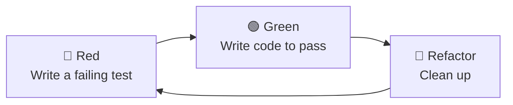
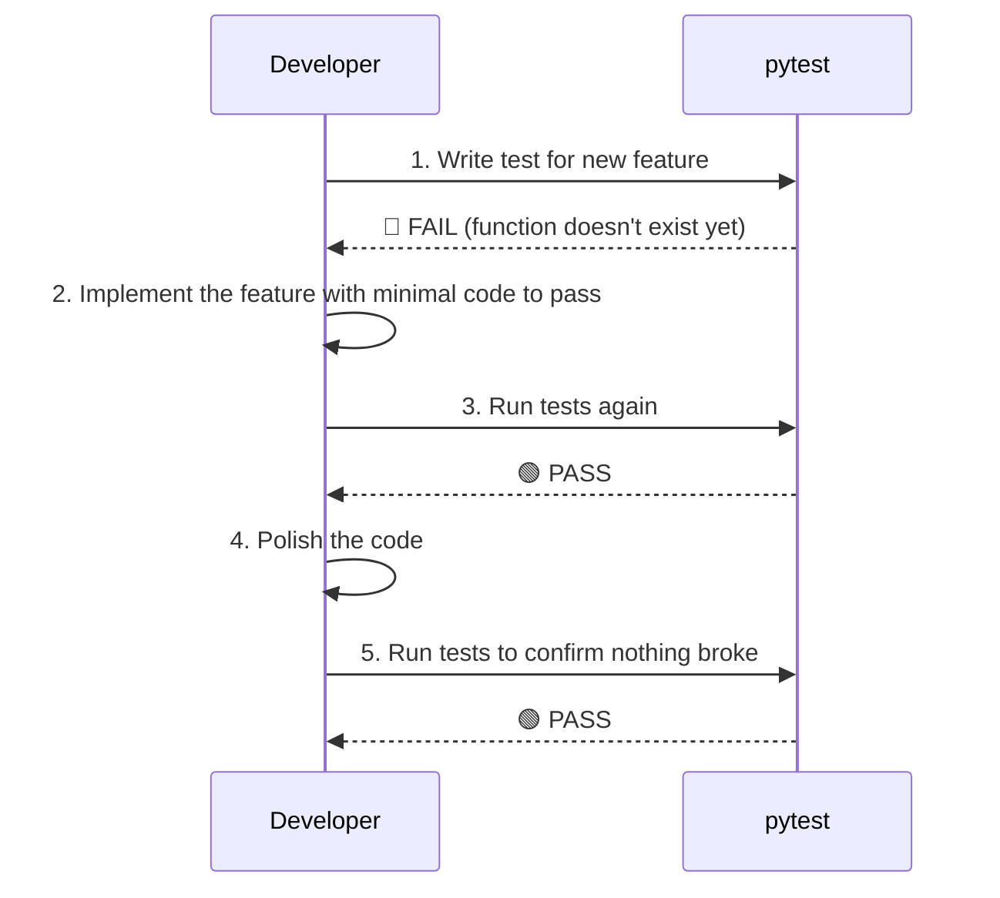

# Test-Driven Development (TDD)

## Background

Modular code is easy to **test in isolation**. TDD takes this further: write the test *first*, then write the code to make it pass.



!!! info "Why test?"
    - Catch bugs **before** they reach production  
    - Refactor with confidence: tests tell you if you broke something  
    - Tests serve as living documentation of expected behavior

---

## Project structure with `tests/`

Tests live in a `tests/` folder, mirroring the source files they test.

> Examples: [Pytorch](https://github.com/pytorch/pytorch), [YOLOv10](https://github.com/THU-MIG/yolov10)

```text
ml_project/
├── config.json
├── dataset.py
├── model.py
├── trainer.py
├── visualizer.py
├── main.py
└── tests/               # ← test folder
    ├── test_dataset.py
    ├── test_model.py
    └── test_trainer.py
```

!!! tip "Naming convention"
    `pytest` auto-discovers files named `test_*.py` and functions named `test_*`.

---

## What a test looks like

A simple model wrapper and two tests: does it train and does it predict the right shape?

=== "Source: `model.py`"

    ```python title="model.py"
    from sklearn.linear_model import LinearRegression

    class Model:
        def __init__(self):
            self.model = LinearRegression()

        def train(self, X, y):
            self.model.fit(X, y)

        def predict(self, X):
            return self.model.predict(X)
    ```

=== "Test: `test_model.py`"

    ```python title="tests/test_model.py"
    import numpy as np
    from model import Model

    X = np.array([[1], [2], [3]])
    y = np.array([1, 2, 3])

    def test_train_runs():
        model = Model()
        model.train(X, y)

    def test_predict_shape():
        model = Model()
        model.train(X, y)
        preds = model.predict(X)
        assert preds.shape == y.shape
    ```

Each test does **one thing**: set up input, call the function, check the result with `assert`.

---

## Running `pytest`

```shell
pytest -v tests
```

??? example "Output"

    ```text
    ========================= test session starts ==========================
    platform linux -- Python 3.10.12, pytest-8.1.1
    collected 2 items

    tests/test_model.py::test_train_runs       PASSED                [ 50%]
    tests/test_model.py::test_predict_shape    PASSED                [100%]

    ========================== 2 passed in 0.12s ===========================
    ```

When a test **fails**, pytest shows exactly what went wrong:

??? example "Failed output"

    ```text
    ========================= test session starts ==========================
    collected 2 items

    tests/test_model.py::test_train_runs       PASSED                [ 50%]
    tests/test_model.py::test_predict_shape    FAILED                [100%]

    =========================== FAILURES ===================================
    _________________________ test_predict_shape ___________________________

        def test_predict_shape():
            model = Model()
            model.train(X, y)
            preds = model.predict(X)
    >       assert preds.shape == (5,)
    E       AssertionError: assert (3,) == (5,)
    E         At index 0 diff: 3 != 5

    ======================== 1 failed, 1 passed in 0.15s ===================
    ```

---

## TDD in practice



!!! tip "When to run tests"
    - After every change locally (`pytest -v tests`)
    - Automatically on every push via [CI/CD](../03-github/ci_cd.md)
