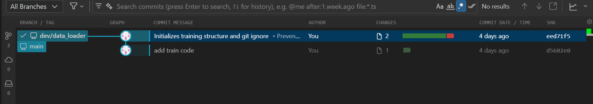
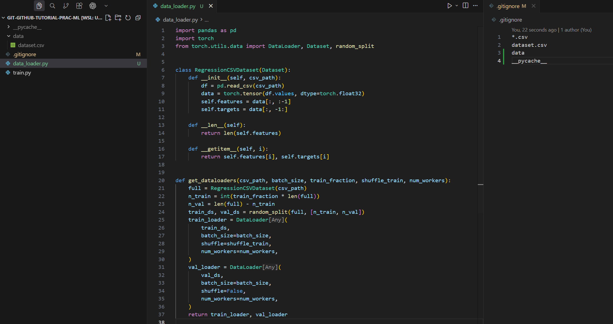
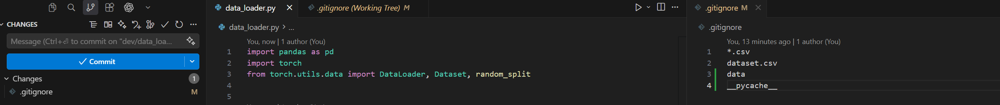
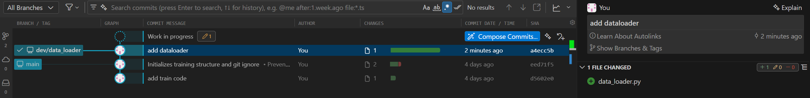
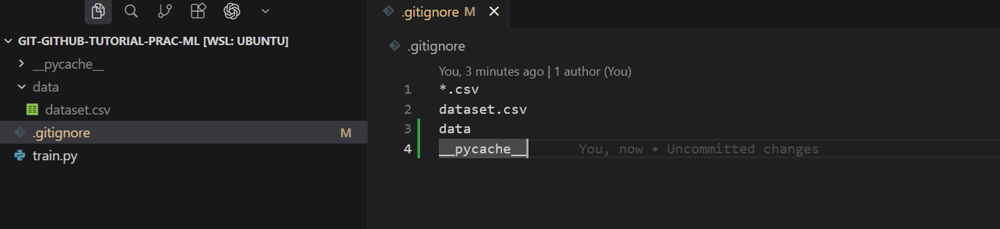
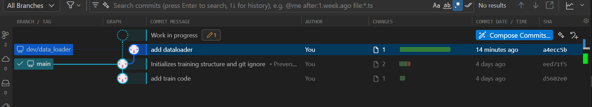
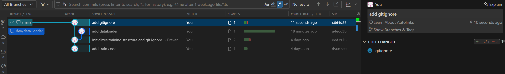

## Create a branch

Let's develope a feature. 

Create local branch.

```shell
git branch  # List available branches
git branch dev/data_loader  # Create new branch called `dev/data_loader`. 

# NOTE: `dev/` is not strictly needed.
```

!!! tip "Consistent Branch Naming"
    Use a descriptive branch naming convention, such as `feature/`, `bugfix/`, or `dev/`, followed by the purpose (e.g., `dev/data_loader`). This makes tracking branches and their purposes easier in your repository. 


```shell
git branch  # View our new branch
git checkout dev/data_loader  # Move from master to the example branch
git branch  # See that we are on our new branch
```

!!! tip
    
    You can create a new branch and switch to it at the same time using:

    ```shell
    git checkout -b dev/data_loader
    ```

    Or, using the newer command:

    ```shell
    git switch -c dev/data_loader
    ```




## Develop in a new branch

Make your changes. We create `data_loader.py` and write code lines:



??? "See the code and copy and paste to your machine"

    ```python title="data_loader.py"
    import pandas as pd
    import torch
    from torch.utils.data import DataLoader, Dataset, random_split


    class RegressionCSVDataset(Dataset):
        def __init__(self, csv_path):
            df = pd.read_csv(csv_path)
            data = torch.tensor(df.values, dtype=torch.float32)
            self.features = data[:, :-1]
            self.targets = data[:, -1:]

        def __len__(self):
            return len(self.features)

        def __getitem__(self, i):
            return self.features[i], self.targets[i]


    def get_dataloaders(csv_path, batch_size, train_fraction, shuffle_train, num_workers):
        full = RegressionCSVDataset(csv_path)
        n_train = int(train_fraction * len(full))
        n_val = len(full) - n_train
        train_ds, val_ds = random_split(full, [n_train, n_val])
        train_loader = DataLoader(
            train_ds,
            batch_size=batch_size,
            shuffle=shuffle_train,
            num_workers=num_workers,
        )
        val_loader = DataLoader(
            val_ds,
            batch_size=batch_size,
            shuffle=False,
            num_workers=num_workers,
        )
        return train_loader, val_loader
    ```


Stage the changes:

```shell
git add data_loader.py  # Add the changed file to staging area
```


Commit the changes:

```shell
git commit -m "add dataloader"   # Commit file
```







Switch back to the `main` branch:

```shell
git checkout main
# or with the newer command:
git switch main
```

!!! note
    You no longer see `dataloader.py` in `main`







Keep developing in `main` branch.

```shell
git add .gitignore
git commit -m "update gitignore"
```



!!! tip
    To visualize the commit graph in shell,
    ```shell
    git log --graph --oneline --decorate --all
    ```

## Others

### Rename a branch

```shell
git branch -m new_name                   # Rename current branch to new_name
# or
git branch -m old_name new_name          # Rename branch old_name to new_name
```


### Delete a branch

Delete a local branch
```shell
git branch -a                            # After merging branch still exists
git branch -d example                    # Remove the local branch example
git branch -a                            # Local branch gone; remote still there
```

Delete a remote branch
```shell
git branch -a                            # Remote branch still exists
git push origin --delete example         # Remove remote branch
git branch -a                            # All done, both local and remote removed
```

### Create a branch from a certain commit

```shell
git branch <new-branch-name> <commit-hash>
git checkout <new-branch-name>
# Or, do the above all at once:
git checkout -b <new-branch-name> <commit-hash>
```
