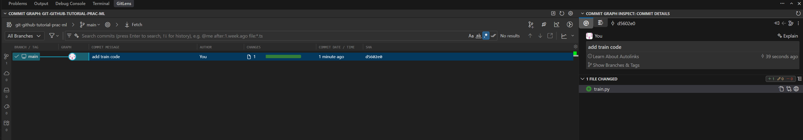
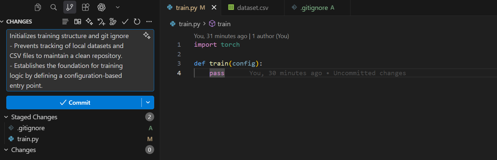
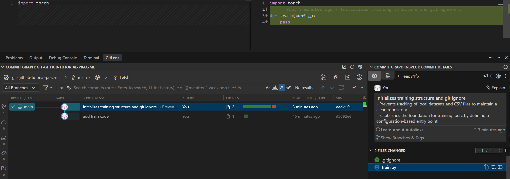

A **commit** is a snapshot of your project at a point in time. This page walks through the basic workflow: initialize a repo, stage files, and make your first commit.

## Create local repository

```shell
cd <my_project_dir>  # Move to your project directory
ls -la  # see what files are inside
# ls -Force  # For windows powershell
```

Initialize git repos:
```shell
git init  # Initialize git repository
git branch -m main  # Rename default branch to `main` (older Git versions default to `master`)
ls -la  # You will see newly created `.git` directory. This will contain all the version history.
# ls -Force  # For windows powershell
```

Check status:

```shell
git status
```

## Create a file
Create a file `train.py`

```python title="train.py"
import torch
```


and check status:

```shell
git status
```

In vscode, it will look like:


## Stage
Staging lets you choose exactly which changes to include in your next commit, rather than committing everything at once.

Add file(s) to the staging area:
```shell
git status  # Current state of our directory
git add train.py  # Add a single file to the staging area
# OR -> To add all
git add .  # Add everything that isn't "ignored"
git status  # Git shows us what is and is not staged
```


## Remove file(s) from the staged area

```shell
git status  # Check status
git reset train.py  # Remove train.py from the staging area
# Or, to remove all,
git reset  # Resets all staged files
git status
```
For newer command,
```shell
git restore --staged train.py
# OR -> To remove all
git restore --staged .
```


## Commit staged file
```shell
git status  # check status
git commit -m "add train code"  # Commit, -m is to give it a message
git status  # Check our staging area
git log  # View commit history
# Or, for one-line short log view,
git log --oneline
```

!!! note

    After `git log`, the terminal shows one block per commit (newest first): hash, author, date, then the message indented with four spaces:

    ```shell-session
    $ git log
    commit a1b2c3d4e5f678901234567890abcdef12345678 (HEAD -> main)
    Author: Your Name <you@example.com>
    Date:   Tue Mar 24 10:30:00 2026 +0000

        add train code
    ```

    If you have several commits, Git prints the same pattern for each. Press `q` to leave the pager.




## Track change by git
When you make changes to the committed file, git will track the changes.


## Ignoring files
If you want git to ignore specific file(s) from tracking, create a `.gitignore` and list them inside.


??? "`dataset.csv` is here"
    ```text title="dataset.csv"
    x1	x2	x3	x4	y
    -0.14409	-0.172904	-0.111316	0.701984	0.074629
    -1.497353	0.332318	-0.267337	-0.216959	-2.279996
    0.232298	1.163559	0.656637	0.110507	1.192492
    -1.014662	0.246342	1.311081	0.041657	-1.951848
    0.531776	-1.453545	-0.312277	0.490363	-0.075181
    -0.24063	0.3766	0.248213	0.782327	0.217053
    0.568251	-1.51452	-2.619945	-0.606891	-3.465328
    0.876012	0.664266	-1.219075	0.847361	1.767947
    -0.086244	-0.2939	0.11442	0.818636	0.161617
    0.349885	0.649948	0.478492	-0.626985	0.496446
    -0.469968	0.499326	-0.250116	2.335754	-0.922259
    -1.098875	0.768474	1.42185	0.505693	-1.428301
    1.426345	-0.094027	-1.422959	-0.532077	1.049665
    -1.443678	0.033531	0.253237	-0.315592	-2.349529
    0.58078	2.321409	0.619968	-0.609403	2.37359
    -0.831581	0.952274	-0.566833	-0.070261	-0.729497
    -0.723463	-0.293658	-1.841286	-1.082479	-2.905255
    0.415761	1.193493	-0.018467	0.261364	1.922375
    1.084741	0.893355	0.273693	-1.010944	2.212809
    0.381047	1.226942	-0.029907	1.953101	1.291735
    1.59306	0.115119	-0.516269	-1.128448	2.058778
    1.423321	0.816374	0.688884	-2.375873	3.389345
    0.555852	-0.549926	-0.627384	-0.00231	0.399844
    -1.055101	-0.427805	1.361785	-0.446151	-2.877723
    0.097776	-1.241289	0.219945	-1.209618	-1.078868
    0.003181	2.283431	0.280841	1.365689	1.828435
    -0.122139	0.323146	1.745721	-1.680916	-0.782043
    0.591354	1.533546	0.712386	0.052071	2.101801
    -1.24818	0.195423	-0.191697	2.020267	-2.203102
    0.320392	-1.569001	-0.395463	0.261148	-0.606522
    1.448102	-0.044148	-1.117245	0.45785	2.106049
    0.491658	-0.700288	1.133384	0.087896	-0.178521
    1.274073	0.609272	0.286516	2.152795	2.141015
    -0.295964	0.111967	1.482769	0.118712	-0.962346
    1.195731	-0.512859	-1.72657	0.299423	0.498526
    -0.60801	0.871086	0.607567	-0.994992	-0.799123
    -0.196105	-1.483025	0.45295	-0.045215	-1.624291
    0.522946	0.488093	-0.577537	0.400352	1.554039
    -0.712667	0.38089	0.002756	2.26601	-1.484756
    0.695284	-0.306245	-0.100198	1.901589	0.474336
    2.240944	-0.442148	0.350512	-0.490848	2.3095
    0.062483	-0.282572	0.202492	-2.105028	0.484489
    -0.166997	1.742906	-1.007112	0.292536	1.35893
    -0.869729	-1.4953	-0.54651	0.472488	-1.89735
    1.290367	-0.257012	-1.602251	-0.43503	0.569951
    0.465663	-1.956939	-0.035052	1.398168	-0.642259
    0.561687	0.309302	-1.240206	-0.843243	0.145017
    0.503198	0.580184	-0.478209	-1.151942	0.76956
    -1.156974	0.643409	-2.312281	-0.333278	-3.465183
    1.522013	0.0713	1.001284	-0.399004	1.59935
    -0.674393	1.527336	0.994221	0.487398	0.430354
    -0.032341	0.62035	0.307592	-0.221886	0.495374
    1.506605	-1.39948	-0.399846	0.428337	1.096706
    -1.348447	-2.255562	-1.906367	-0.071111	-4.56697
    0.345219	-0.769675	-1.224238	-2.023045	-0.282363
    0.370054	0.992994	0.790796	-0.190716	1.198492
    -0.136367	-0.660836	-0.520578	-0.584812	-1.484207
    0.156326	0.249886	-0.362266	-0.713841	-0.004506
    1.716871	0.038255	-0.507634	-0.591447	2.103916
    -1.264766	-0.125261	0.061182	1.844679	-2.088116
    1.034029	-0.712949	0.669922	-1.139382	0.371742
    0.418737	-0.766409	1.99938	0.567374	-1.268773
    0.55286	-0.407412	0.001376	0.465765	0.866315
    -2.039151	-1.15832	0.772624	1.301204	-3.262492
    1.803168	-2.055537	0.769482	-1.91629	0.592208
    0.253349	-1.141169	2.009901	0.643971	-1.799449
    0.293468	-0.73114	0.111295	-0.465195	-0.387973
    -1.423286	0.317405	1.814188	-0.82696	-3.546473
    0.202002	-0.689702	0.647894	0.09705	-0.449996
    1.762016	0.791615	-0.167107	-0.636675	3.021147
    1.230941	-0.146478	0.459438	-0.184457	1.530987
    -0.115979	0.763854	-0.183211	0.829587	0.936578
    -0.11661	-0.859777	-0.94012	-0.740737	-1.718368
    0.865796	-0.046602	1.570101	2.27933	-0.051269
    -1.548017	-0.381454	-0.075348	-1.488442	-2.614919
    0.286946	-0.459428	-0.768426	-0.758757	-0.405116
    -0.159646	-0.82993	-0.372898	0.954344	-0.58319
    0.481847	0.727885	0.749118	1.399695	1.263758
    1.132733	-0.792854	-0.39654	1.196087	1.235394
    0.002098	-1.191414	0.56166	-0.630373	-1.600305
    -0.648134	0.246494	-2.121032	0.360763	-2.063422
    -0.584526	1.036927	0.61144	-0.606284	-0.801157
    0.695151	-1.516074	-0.332622	-0.631047	-0.839977
    0.211127	0.036788	1.134848	0.228063	0.057329
    -1.210855	0.72185	0.528147	1.45081	-1.493982
    0.026418	-0.058693	-0.087611	0.01039	-0.206718
    0.824986	0.653206	1.130473	2.249574	0.942447
    -0.036143	0.009784	1.942185	-1.73122	-1.166479
    -1.470831	-2.581571	-2.020833	-1.381769	-4.979229
    -0.86836	-0.227458	-1.163513	0.61095	-1.628168
    1.317652	-0.993105	-0.764827	0.122741	0.82787
    1.42469	0.120407	-1.207834	-0.560335	1.283157
    0.725042	0.383793	-0.119391	0.869607	1.825475
    -0.136234	0.18076	1.528181	-0.098533	-1.012239
    -1.045837	0.686052	-0.587645	0.343685	-1.226943
    1.043187	-1.331938	-0.777342	1.058581	0.234199
    -0.079455	0.074256	-0.998557	1.342933	-0.032043
    -1.971618	-1.44899	0.808232	-1.303024	-4.050157
    0.129552	0.69185	-0.223253	0.095221	0.740264
    1.292362	-0.495314	0.339733	-0.511638	1.002411
    -0.168163	-0.162464	-1.013781	0.796413	-0.116889
    0.243148	0.732335	0.838068	0.927986	1.208607
    0.212257	0.864007	0.068832	-0.973918	0.629082
    -1.888415	-0.0059	0.413372	1.235981	-2.597455
    0.92814	-0.000538	-1.023476	-1.41138	0.767629
    -1.366148	0.633708	-0.207615	0.570315	-1.312674
    1.04405	1.060193	-0.645338	-0.274316	2.191222
    -1.621312	0.675217	1.188795	-0.006428	-2.670342
    1.090905	-2.344962	0.177475	0.143284	-0.703568
    1.391575	0.970735	-0.261157	-0.086696	2.98605
    -0.51212	-1.3082	1.379948	1.028	-1.853398
    -1.094336	2.080845	1.980165	0.188057	-1.747843
    -0.86643	0.418549	-0.913014	-0.034211	-1.229221
    -1.506824	2.005729	1.566708	-1.237086	-2.56738
    -0.283422	-1.031143	-0.263721	-2.581186	-0.838179
    1.802856	-1.116595	-0.273069	-1.489609	1.386139
    -0.225319	1.940733	0.206839	-0.37218	0.873334
    -0.506228	-1.339308	0.301948	-0.174869	-1.861335
    0.375457	-0.51032	0.421576	1.737697	-0.225967
    1.737426	-0.242803	-0.766627	2.427221	1.69496
    1.370403	0.817594	-1.680595	0.12082	1.989871
    -1.341793	-1.771711	0.10229	0.590253	-2.495227
    -0.305829	-0.798517	-0.986861	-0.555161	-1.916673
    -0.203275	-0.022887	-0.895988	-0.23205	-0.895936
    -0.004472	0.507088	0.178125	0.472151	0.553701
    -0.378696	0.276739	0.641162	-1.598003	-0.467919
    1.206421	-0.178611	-0.094758	0.450457	2.002911
    0.674637	0.072414	0.152496	-0.782444	0.601074
    1.253122	-0.20417	-0.168564	-0.491503	1.375219
    -0.854679	0.910502	-0.936973	-1.057781	-1.376675
    0.130179	0.297557	1.062537	-0.412496	-0.231467
    -0.909817	1.259169	0.632459	0.536519	-0.308575
    -0.785599	-0.327372	0.501779	-0.019184	-1.479396
    -1.35982	0.181094	-0.691927	-1.083337	-2.50268
    -1.856504	0.69857	0.852013	-0.053436	-2.906609
    -0.945369	-0.151123	-2.423734	0.180477	-3.327791
    -0.311895	-0.494402	0.181967	0.350644	-0.422474
    0.018397	-0.689758	-0.461265	0.181946	-0.254312
    -0.320273	-1.052527	-0.870107	-2.096335	-1.089835
    -1.361324	-1.23351	-1.976015	-1.117988	-4.345427
    -1.311354	-1.749642	0.178263	-0.341171	-3.1509
    0.74056	-0.008499	-1.297761	-0.1238	0.463064
    -0.582989	-1.437461	1.102612	-0.415248	-2.663688
    0.015962	1.030472	0.26362	-0.333226	0.630953
    2.147024	1.387786	0.672871	-1.12228	4.866805
    -1.198657	-0.371803	-0.699889	1.626892	-2.177692
    -1.427125	0.267587	0.546906	-0.318483	-2.521745
    -0.725033	-0.436849	0.022732	-0.51991	-1.673679
    -0.949947	-1.731387	-0.739393	1.348891	-2.547987
    2.340809	0.491484	-1.164426	-0.834286	3.241288
    -1.177644	2.374579	-0.990891	0.680943	-0.154306
    -0.1092	-0.995861	-0.273066	0.362216	-0.561528
    0.056717	-1.400222	0.042324	-0.673358	-1.752351
    -0.69756	-1.432451	0.586854	1.944165	-2.195607
    -0.573209	-0.467394	0.688782	1.061286	-1.013224
    -0.142636	2.206929	-0.107452	-0.485321	1.127619
    0.579702	-1.021642	-0.248403	-1.166361	-0.446776
    1.876925	0.741722	-0.092543	-0.933112	3.216324
    1.050733	-0.561687	1.450421	-1.373636	0.064725
    1.742764	-2.007839	1.188413	-1.851377	0.04239
    -0.172535	0.824293	-3.154543	-1.91781	-2.890796
    0.036895	-0.893217	-0.220867	-1.186173	-1.044066
    -0.846766	0.244021	0.58142	1.43293	-1.190832
    -0.317992	0.047745	-0.294919	-0.051991	-0.706439
    0.371755	-0.915192	-0.956962	-1.588126	-0.408174
    -0.140609	1.149492	0.272302	-1.703361	0.638274
    0.757932	-0.765683	-1.090344	-0.179379	-0.187049
    -1.011867	-0.326145	-0.478493	-2.58999	-1.330833
    -0.811375	1.304439	-1.150124	-1.579598	-0.697728
    -1.585055	-0.636174	0.597337	-0.329646	-3.284039
    0.188035	-0.194323	1.283855	0.588648	0.322281
    -1.645894	-0.021675	-1.066654	1.154751	-2.445935
    0.754038	-0.777332	-0.745152	-2.02968	0.760177
    0.508219	-0.26086	0.933515	0.750916	0.78808
    -1.623537	-0.713836	0.195442	0.355421	-2.379475
    -1.008636	0.127209	2.205354	0.691922	-2.592476
    -0.019187	0.767627	1.80399	0.106642	-0.314529
    -0.875139	0.590099	0.904217	-0.752003	-1.547298
    -0.675247	-0.805239	-0.001192	1.93199	-1.808746
    0.935785	-0.731798	0.077497	-1.176556	0.291466
    0.835641	-0.038397	1.451296	-0.202416	0.278143
    1.276682	-0.648617	-1.519765	1.301277	0.702817
    -2.165195	0.044529	-0.403787	1.74484	-3.529491
    -0.580768	-0.910401	-1.054056	-0.700496	-2.498427
    -1.031197	-1.606585	-1.497279	-1.559675	-3.357916
    -0.683689	-1.22647	0.478271	-0.048076	-2.014103
    -0.463973	1.59288	0.239814	0.475378	0.466314
    -0.653734	-2.171007	-0.426204	0.37331	-2.272425
    0.518609	-1.02275	0.575803	-1.553609	-0.309278
    0.419807	0.535921	-0.127263	1.939714	0.745335
    -0.450996	-2.759507	1.768934	-0.368998	-4.174274
    1.320904	1.235506	0.108326	-1.434922	3.221541
    -0.621392	-1.170772	1.043372	-2.132592	-1.630417
    0.459355	2.051011	0.325174	-2.058431	2.753461
    0.064667	0.355564	0.980816	-1.959676	0.325514
    0.969861	1.54397	1.861024	-0.390219	1.592358
    1.711712	1.19807	0.723685	0.827797	4.106469
    -1.44725	0.982848	-0.347067	-0.028134	-1.805994
    -0.392907	0.232749	-1.021859	0.0685	-0.695935
    -0.077355	-0.74363	0.78662	1.872637	-1.243606
    1.234463	0.889264	-2.653252	-0.761194	-0.207026
    0.781772	0.188488	0.474398	0.636279	1.596415
    -0.74655	-1.222889	-0.170271	-0.119103	-2.011331
    -0.727308	0.906525	0.917111	1.546519	-0.68479
    0.185511	0.672424	0.609752	-0.651815	0.431716
    1.718518	1.976953	0.035226	0.32427	5.160165
    -0.002546	0.619289	-0.12118	-0.193783	0.527164
    0.164715	0.06701	0.882019	0.150333	0.198869
    -0.063564	-1.220416	-0.030972	-1.136885	-1.374598
    -1.181438	0.916709	0.749235	0.280428	-1.224526
    0.416301	-1.964998	-1.09682	-0.148733	-1.622671
    -0.079396	-1.00461	0.133446	-0.4537	-1.395851
    0.329502	-0.209978	1.196483	0.665532	0.336674
    0.321667	-0.845178	-0.935627	-1.471158	-0.298005
    -1.079445	-0.209832	-0.360389	-0.281098	-2.097147
    -1.868345	-0.998194	-1.39067	-0.12678	-4.099952
    -0.68718	0.215879	-0.582785	0.932094	-0.622181
    0.225157	-1.325297	0.656873	-0.405183	-1.210193
    0.330005	-0.173443	0.217439	-0.385296	0.176339
    0.934289	0.482494	-1.18014	-1.099306	0.946276
    -0.245003	0.448016	-0.896538	1.177074	0.006913
    -2.012782	-0.475317	-2.585185	-0.751729	-6.062074
    -0.61041	-0.325254	-0.394102	-0.593734	-1.427513
    1.214902	-1.141841	1.2539	-1.621367	0.028826
    1.525193	-2.239553	0.574786	-1.253494	-0.586703
    -0.180203	1.697204	-0.810603	-0.069015	0.809639
    -0.251777	-0.822067	-0.0592	0.093511	-0.805394
    -0.943052	-0.449131	0.322943	-0.167167	-1.895571
    -0.017003	-0.695839	-0.79969	0.44073	-0.587798
    1.165384	0.217305	-1.276541	0.283027	1.663634
    0.762161	1.15885	-0.366419	-0.707763	1.682672
    -0.981088	-0.746442	0.284502	0.015266	-1.995876
    -0.738256	0.347886	-0.501599	-1.040157	-1.379543
    -0.264494	-1.070041	0.827176	0.846012	-0.984042
    0.13104	0.527308	-0.030922	0.891292	1.270559
    0.080493	0.440253	0.873452	-0.338043	-0.203973
    0.906001	-1.568764	1.788837	0.870433	-0.834218
    0.051096	1.751358	-0.946226	-1.160193	0.781096
    -0.261797	-1.006469	0.153861	0.135945	-1.130273
    1.603053	-1.392074	-1.276723	0.37612	0.556675
    0.417727	-0.618971	-1.03334	-0.645543	-0.808568
    0.524996	-0.479958	0.76143	0.588075	0.690492
    0.900719	0.784353	0.769853	-0.516692	1.494429
    -1.830127	0.291751	-0.673766	0.401545	-2.390389
    -1.352094	-1.013839	-0.349346	-0.517601	-2.974708
    -1.155424	0.047178	-1.688486	-2.15511	-2.204043
    -1.305313	-0.559918	-1.417363	-1.408871	-3.153914
    -0.410128	0.982587	0.449512	-0.261119	-0.113989
    1.116554	0.411298	-0.406316	1.018603	2.652092
    0.660534	1.770677	0.926599	0.848859	2.656314
    -1.113549	-0.049483	-1.669458	-0.592954	-2.987369
    -0.665155	0.533191	-1.351251	-0.493641	-1.533895
    0.208512	0.290283	1.704724	1.296804	-0.330816
    1.317899	-0.615244	-0.01759	0.015213	1.464833
    -1.129267	0.451861	0.524015	0.811513	-1.106433
    1.003412	-0.711544	1.147059	0.35224	0.456006
    0.40792	0.179305	-0.355656	-0.736254	0.249029
    -1.442157	1.690719	-1.128279	-0.661283	-2.04269
    0.585031	0.720245	1.516708	-0.312143	0.344262
    0.844268	0.796278	-0.326889	-1.26558	1.891227
    0.575847	-1.373474	0.779954	-1.440977	-0.77955
    -1.123309	-0.637831	-0.833311	-0.613311	-2.631673
    0.294591	0.628732	1.092342	-0.372703	0.268658
    0.538153	1.706739	0.899078	1.381551	2.361957
    1.057265	-1.78467	0.880859	0.212925	-0.298383
    -0.527255	-0.425274	0.416181	0.839976	-0.879291
    0.218104	-0.560687	-0.950803	0.392622	-0.183557
    -0.659037	-0.769165	0.281299	-0.010038	-1.670231
    -0.840998	-0.182506	0.405148	-1.049715	-1.764256
    -0.824003	2.727745	-0.941003	-0.790126	-0.239962
    -0.902381	0.827631	1.801416	-0.38762	-2.270836
    -0.51776	-0.000029	1.431734	0.894246	-1.16324
    1.545904	1.162061	0.486368	-0.659217	3.097137
    -0.795466	0.467606	-0.316471	-2.234962	-0.38058
    0.191453	1.078483	-0.13618	0.188467	1.484242
    0.387797	0.288002	3.214391	-0.169	-2.910792
    1.734029	-0.805008	-1.040997	-1.432066	1.239347
    0.625631	0.741488	-1.35356	1.005859	1.533805
    -0.097311	0.032566	0.675596	0.367144	0.098264
    -1.086086	-0.174622	-1.212473	0.631277	-1.753011
    -0.098815	0.296799	-1.556516	0.857925	-0.375407
    0.129051	1.11537	-0.756501	1.197234	1.235036
    0.02819	0.556046	-1.247026	0.594106	0.370829
    1.036277	-0.216807	-0.363317	0.369638	1.5859
    -1.173969	-0.193958	1.26763	-0.093104	-2.620754
    0.715937	-1.853444	-2.120267	-0.00415	-2.2297
    0.220399	-0.892783	-0.1505	-1.398733	-0.55638
    -1.615319	-0.149243	0.261579	-1.756626	-2.417384
    0.788146	1.548968	-1.50396	0.339918	2.008478
    -1.345258	1.596074	0.668182	-0.804194	-1.750117
    0.641946	0.181293	2.247279	0.605779	-0.574246
    -0.2902	-0.736576	-0.204147	0.013466	-1.062416
    -1.084918	1.363405	0.597342	-0.670739	-1.314036
    0.675181	1.267307	-1.055313	0.779882	2.184997
    1.155045	-0.192449	-2.271779	0.035354	-0.454501
    -0.217149	-0.058192	-0.401305	-1.48692	-0.635139
    -0.844591	-0.248109	1.2885	0.709085	-1.616438
    1.273878	-1.368062	0.685021	-0.175235	0.177435
    0.638462	-0.679575	0.801158	-0.00931	0.383645
    -0.304261	1.269175	0.64709	-1.174126	0.177722
    -1.060411	-2.231995	0.853316	1.068953	-2.771899
    -0.261019	1.583682	0.711868	-0.655866	0.268178
    -1.243292	-0.558968	-1.05113	-2.200017	-2.272875
    1.222328	-1.097822	-0.550032	-1.160974	0.355934
    0.001197	0.490745	-0.105687	-1.171027	-0.048938
    0.837266	-0.057407	0.774402	-3.162596	1.104782
    -0.493967	2.172857	-0.510755	0.028269	0.79604
    -0.875795	0.872738	-0.645216	1.289103	-0.578568
    0.495637	-0.724194	-0.210571	0.299912	0.086815
    -0.551749	0.938074	-1.268181	1.278978	-0.571
    0.323257	-1.147664	0.484378	0.462728	-0.093693
    1.35407	1.253524	0.208919	-1.226164	3.230785
    -1.304135	-0.43871	0.737109	0.443558	-1.842876
    -0.004053	-1.690069	-0.275258	0.17406	-1.271847
    1.412454	-0.247613	-1.435847	0.466789	1.353029
    1.699892	0.270094	-1.403284	1.079392	2.827254
    -2.004056	0.903074	0.484028	0.17568	-2.531508
    0.491886	-0.693005	1.41099	-1.349524	-0.539244
    1.527687	-1.186135	-0.0054	1.419859	1.055074
    -0.162409	-0.402377	1.167473	-0.607683	-1.452545
    0.540215	-0.207602	-0.866432	-1.341549	-0.022295
    -1.179804	-1.72055	-0.726877	0.300215	-2.664346
    -0.826633	-1.018019	-0.993389	-1.387898	-2.540714
    0.714362	-1.404612	0.017316	-0.618054	-0.386609
    -1.796928	0.193301	-0.333751	-0.77113	-3.061198
    0.155585	-1.068905	0.426277	0.389169	-0.245528
    -0.609971	1.470444	-0.196817	-1.976012	0.45729
    -0.08159	-0.882351	0.93324	-0.471628	-1.360933
    -0.082701	0.750322	0.679478	0.473168	0.543434
    0.919713	0.021762	2.002261	0.47867	0.455898
    -0.764893	-0.406142	0.096718	-1.170476	-1.87684
    -0.108583	-0.077871	0.202075	1.117104	0.068741
    0.680876	-0.144635	-0.194012	0.257068	0.84591
    0.066357	-0.638257	-0.929839	-1.886991	-0.509315
    -1.877436	0.870123	-0.239307	-1.682072	-2.448319
    0.754954	-0.594883	-0.281218	-0.369183	0.220743
    -1.699767	-0.04546	-0.558093	2.953779	-2.870224
    -0.455625	0.988477	-0.156032	0.253342	0.122231
    1.555228	-0.627675	0.37535	1.132358	1.895551
    -0.000149	0.586513	0.682682	-1.090098	-0.041368
    -0.945369	-0.74537	-0.648391	1.215978	-1.535773
    2.605453	-0.05655	-0.841407	-0.969482	3.358736
    -1.538378	-0.316969	-0.566063	1.749995	-2.855218
    1.101663	1.313353	-0.16677	0.465495	3.159167
    -0.088208	-0.215027	-2.579583	0.415377	-2.254608
    -1.693376	-1.412276	-0.749289	-0.529182	-3.817047
    -0.958124	-1.007857	0.306513	-0.475248	-2.462207
    -0.22968	0.4572	-0.154275	0.861539	0.44906
    0.889034	1.247082	-1.460475	0.921995	2.453661
    -0.972529	-0.031871	-0.357204	0.440834	-1.11304
    -0.669296	1.312557	-0.856681	-0.138319	-0.386536
    1.953438	-0.512655	0.782295	0.220042	2.107363
    -0.955188	-1.204771	-0.503317	-0.416788	-2.584906
    1.277694	0.422476	2.653063	-0.243428	-0.216901
    0.414412	1.506567	-0.378716	0.845258	2.543807
    -0.720813	-0.074872	0.504306	-0.434779	-1.668186
    1.832733	-0.22965	1.734093	-0.508425	1.021169
    0.797139	-0.206019	-0.898868	-0.719911	0.301836
    -0.666114	0.088068	-2.257286	-0.558122	-3.149762
    -0.512642	-0.993587	-0.883505	0.070521	-1.493458
    -1.398426	-0.27626	0.97705	0.334458	-2.307691
    -0.450713	0.013262	-0.101064	-2.186462	-0.331804
    -1.949589	1.291057	0.822649	-0.788234	-2.985214
    2.448647	-0.623076	1.299275	0.362505	2.548541
    -1.105911	-0.555925	-0.394913	-2.315776	-1.523044
    -0.321731	0.459244	-0.419227	2.998273	-0.532368
    -0.933059	0.705205	2.358468	-0.992419	-3.106324
    -0.917029	1.293367	0.075395	2.229999	-0.801956
    -0.647723	2.935701	-1.124159	-0.313621	0.507204
    -0.734783	-0.641351	0.13063	0.452487	-1.126632
    -0.745697	0.196894	0.637425	1.503991	-1.033279
    -1.252979	0.028417	-0.620594	1.319031	-1.98257
    0.559733	-1.065396	1.272057	0.771162	-0.222193
    0.504939	-0.33688	0.675777	-0.049627	0.337201
    0.058576	-2.481191	-0.513658	1.517492	-1.796315
    0.104549	-0.126034	-0.335248	0.630561	0.512104
    -0.979092	0.66165	1.232897	-0.954865	-2.047713
    0.463565	0.722753	-0.420535	-0.528678	0.831018
    0.385233	0.429119	-0.019418	-1.364224	0.642605
    0.636824	-1.221088	0.226357	-0.360798	-0.564621
    0.026698	1.676352	0.288817	-0.295666	0.933221
    0.512238	1.136703	0.607376	1.165954	2.048079
    -1.303275	-0.04495	0.524868	0.721012	-1.688471
    -0.063365	0.36587	1.271293	1.005239	0.112103
    0.396223	-1.025281	-1.10096	-0.091855	-0.688594
    0.395353	0.561096	-1.501556	-1.461654	0.334075
    -0.034638	-1.313688	0.882167	0.258036	-0.789948
    1.25	0.346697	-0.15111	0.232296	2.420348
    -1.438797	0.927522	0.274858	-2.754707	-1.471308
    -0.828742	0.98089	-0.044055	1.487407	-0.73794
    -1.075786	1.067095	-0.655221	-1.058632	-1.587522
    -0.759824	0.539328	1.118168	-1.586919	-1.248223
    0.014244	0.082194	0.833256	0.119847	-0.118399
    -1.111894	-1.824709	-0.371112	0.01441	-2.646461
    -0.377769	2.323704	-0.07648	-0.483344	0.790015
    -0.970559	0.208908	-2.064097	0.676094	-2.373146
    0.210571	0.154809	-1.273756	-0.898621	-0.372177
    0.494598	-0.597263	0.421081	0.407711	0.705091
    1.110351	0.411169	-0.449185	1.78369	1.817098
    -0.870512	-1.220246	-0.862397	-0.364085	-2.537451
    0.913185	1.15107	0.152977	0.831493	3.211878
    0.910289	1.602883	-1.510639	-0.741799	1.602423
    -2.677034	0.073678	1.392449	-0.535317	-5.046101
    -0.854054	-0.491728	0.28531	-1.195776	-1.784829
    -1.918759	0.322234	-0.491482	1.489145	-2.663972
    -2.084159	-2.422397	-1.001356	-0.502226	-4.807796
    0.030245	0.673596	-1.365991	-1.800547	0.165114
    -0.360981	-0.103373	-0.64183	-0.173209	-0.735296
    -1.62327	-1.22553	0.641602	1.567408	-3.183163
    -1.262716	-2.00112	0.260542	-1.249354	-3.022068
    2.341604	0.226301	0.485462	-0.117913	3.748817
    -0.00307	0.063357	1.360403	0.626183	0.081392
    -1.63683	-0.555582	-0.903906	0.841779	-2.615886
    0.602332	-1.168988	-0.094341	2.296995	-0.425877
    -1.878532	0.364586	0.826353	-0.493407	-3.409816
    0.661988	0.100825	0.552541	-0.158051	1.119986
    -0.913841	-0.495999	0.514885	0.731742	-1.48773
    1.297313	-1.458118	0.0064	-0.307027	0.056935
    1.13325	-2.347053	-0.730783	-0.902764	-1.229313
    1.550421	0.775469	1.395285	-2.224554	2.959206
    -1.383033	-0.374965	0.244672	0.094625	-2.042012
    -1.978635	-0.835736	-1.48063	-1.638791	-3.891411
    0.182419	1.556614	1.185206	0.06815	1.028852
    0.991792	-0.691603	-1.199424	-1.15041	-0.026995
    1.26553	0.052609	1.224429	0.091342	1.459546
    2.721174	1.821045	0.196907	-0.832195	5.874988
    0.401358	-0.255512	0.467001	0.323041	0.624067
    1.142228	0.31422	-0.723444	-0.770549	1.473493
    -1.071827	0.718342	0.714193	-0.043883	-1.498795
    -1.776339	-1.123965	-1.62593	0.026671	-4.11873
    -0.920662	0.872605	0.129328	0.047587	-0.739699
    1.036452	-1.602824	0.70668	-1.808937	-0.123631
    1.012146	0.691222	0.664741	0.182085	2.386297
    -1.540801	-0.305155	0.047349	2.035285	-2.699341
    1.038428	-0.761346	2.249662	0.471808	-0.73725
    2.345359	-1.426908	-0.8687	-0.234001	1.122419
    0.527211	0.276763	0.113508	1.893807	0.569917
    1.366386	-0.824652	1.462164	1.905214	0.413379
    -0.190514	-1.163259	0.327926	-0.053369	-1.469175
    0.735545	-0.922678	1.442009	0.965164	-0.110878
    0.036164	-0.242567	-0.457393	3.098311	-0.366034
    0.055338	0.991472	-0.384339	-0.628543	0.247926
    1.192035	0.712003	0.469934	-1.508796	2.454881
    0.285304	-0.338064	-1.376741	-0.056683	-0.680586
    0.080035	0.06334	-0.338158	0.882023	0.565412
    0.529087	0.418402	1.008173	-0.96406	0.353869
    0.921995	0.153533	1.125805	0.745243	1.485714
    0.880511	-0.257486	0.956604	1.853764	0.63885
    2.289501	-1.551582	-0.548375	-0.266345	1.100698
    0.372448	-0.368109	1.106107	0.98476	0.272867
    -1.012213	0.547374	0.67429	0.353885	-1.054202
    1.400335	-0.548381	-0.366697	0.667056	1.9623
    0.852598	-0.284011	-1.314706	-1.237582	0.068197
    0.792425	0.792264	-1.815911	0.533896	1.177669
    -1.042106	2.190775	0.263958	0.827415	0.464987
    -0.581119	-0.39679	1.489016	-1.307671	-2.13616
    0.046215	0.970181	0.405391	-0.91318	0.4782
    0.845149	-1.051004	-0.687803	-0.525807	-0.444928
    1.064667	-0.323843	-0.27783	-1.037756	0.800717
    1.484952	0.748288	-1.617397	-0.989707	1.796022
    -0.498122	-0.55324	-0.860492	-1.331069	-1.589963
    -0.380272	1.140378	-0.066708	-0.965171	-0.084363
    1.346147	-0.735737	-1.702576	-0.478966	-0.312109
    1.641618	-1.387745	-0.327695	1.473522	1.050559
    -0.513661	-0.783064	-0.181497	-0.240155	-1.356383
    -0.154665	-1.34997	0.985773	1.036533	-1.243121
    0.772125	0.051247	-1.206798	-0.081075	0.487363
    -0.634155	-0.938898	0.332845	0.186484	-1.616435
    -0.919855	-0.002692	0.464368	0.072241	-1.656938
    1.286905	1.772312	1.583793	0.544104	3.405673
    -0.654192	0.188579	-1.130629	0.12176	-1.36557
    0.585202	-0.354556	0.767069	0.182574	0.452264
    0.843326	-1.173405	-0.264852	-0.537544	-0.202757
    -0.075515	0.270019	0.525471	-2.346115	0.340772
    0.11593	1.012476	0.572588	1.310766	1.089626
    0.10068	-0.499799	-0.435672	-0.830437	-0.838685
    -0.190468	-0.651554	0.026575	-1.818634	-0.516989
    0.177457	0.446229	-0.463497	-0.50822	0.299091
    -0.154504	1.986549	-1.406118	-0.247365	0.255148
    -0.786745	-0.789992	-0.480732	0.782842	-1.455965
    0.610012	-1.440888	-0.405526	1.319809	-0.199076
    0.27228	0.630106	0.575975	0.628006	1.427035
    -1.038454	-0.070739	0.637269	0.749642	-1.225903
    1.306537	-0.500995	-1.34972	1.272387	1.043294
    -0.548686	0.03576	-0.432276	1.006208	-0.350101
    0.311733	0.54087	0.032608	1.026509	1.048731
    -1.168195	-0.039931	-0.413477	-0.950516	-2.186034
    -0.978384	0.217361	0.12429	0.057697	-1.389316
    -0.193166	1.226937	0.543523	0.962839	0.953354
    -1.702283	-0.466468	-0.150678	1.301508	-2.408607
    0.424845	-0.856528	0.128447	-0.261731	-0.380675
    -1.233522	0.463905	-0.029843	0.804382	-1.319638
    -1.126982	3.646272	-0.88005	0.287583	0.430937
    -0.982186	1.727607	-0.06562	0.14948	-0.081323
    -0.791021	-0.487641	-0.345513	-1.372646	-1.681883
    0.473054	0.18332	0.65583	0.865654	1.207901
    -0.241441	1.220417	-0.696664	1.396358	0.516045
    0.764803	1.826552	-2.264798	-0.19226	0.875303
    1.707387	-0.406822	2.72902	-1.527903	-0.506556
    -0.386302	0.50509	-0.565144	-0.451032	-0.898003
    0.108174	-1.497922	-1.309669	0.08687	-1.605587
    1.02709	-1.35313	0.421012	0.3225	0.352391
    -0.803635	-0.079092	0.883986	-0.373756	-1.733757
    -0.273808	1.724796	0.026804	-0.175542	0.526358
    -1.427152	0.38129	-0.22745	0.281277	-1.804785
    -0.150438	-0.623695	0.295199	-0.218164	-0.702766
    -0.688077	1.11881	-1.054493	-0.465332	-1.142111
    1.259637	0.436989	0.137173	0.234455	2.415788
    1.402913	1.389529	-0.0343	0.013261	3.695288
    -0.175254	-0.200177	-0.492804	-0.345891	-0.845193
    0.729853	-0.328297	-0.428365	-0.626822	0.1125
    1.560182	0.508596	0.866501	-0.529898	2.425411
    0.145203	1.452636	-0.013373	-0.044665	1.318537
    0.077487	0.224984	1.492696	1.539713	-0.441395
    1.219038	-2.717651	-0.470292	0.249711	-0.763591
    0.423101	-0.056053	-0.461498	-0.799766	0.288944
    1.122226	1.307777	0.010606	-0.534469	2.695098
    -0.024621	-0.128078	-0.024856	-0.632951	-0.672795
    -0.242405	-1.385422	0.59825	0.838551	-1.174929
    -1.82743	0.39358	0.238432	0.020507	-2.731707
    -1.91774	1.711559	-0.216408	0.504399	-1.807923
    0.41354	-1.278266	-0.445709	-1.355363	-0.89596
    -0.70902	-1.806549	-0.461199	-0.710889	-2.914399
    -0.132839	-0.011341	-0.836974	2.011971	-0.714534
    1.121657	-0.328383	0.893599	0.765575	1.394055
    -0.68221	2.915222	-0.411218	0.486861	1.19831
    0.831397	-0.994585	-1.005292	1.134341	0.300949
    -2.477621	0.023414	-0.181968	0.710668	-3.237382
    0.342197	0.087464	0.290469	-1.152624	0.127945
    -0.85231	-1.34116	0.788254	1.077584	-1.891241
    -0.601232	-0.537128	-0.439875	1.112898	-0.914617
    1.73891	-0.969578	-0.225636	-1.26068	1.046062
    -0.15526	-0.335706	-0.512817	-1.534724	-0.591898
    -0.28387	0.914866	0.550503	-1.311742	-0.027295
    -0.598868	1.532506	-0.029588	-0.503513	-0.285304
    -1.500897	1.274457	2.119355	-1.729797	-3.075943
    -0.110405	-0.594277	1.217537	1.247439	-0.905031
    2.071282	0.032771	-0.241904	0.279804	3.275594
    1.453133	0.616636	-0.354946	-0.185519	2.536029
    0.262509	-1.293638	0.00317	-0.517205	-1.027824
    1.042568	0.786938	-0.122571	-0.709624	1.87143
    -0.016633	0.487919	-0.568175	-0.967279	-0.148968
    1.358802	1.872325	0.7932	-0.990264	3.580957
    -0.84566	-0.770572	0.427611	-1.380325	-1.889723
    -0.053629	0.399123	-0.823429	0.846427	0.505488
    -0.363328	0.945281	-2.660286	0.362312	-2.04907
    -0.794999	0.177209	0.499801	-0.736962	-1.628571
    -0.04142	0.392892	1.226775	-0.46395	-0.479946
    -1.304222	0.300777	-1.719609	0.071777	-2.678088
    2.022969	0.049357	-0.748315	1.026496	3.301547
    0.098338	0.917018	1.09275	-1.732129	0.6301
    -0.016396	-1.06957	-1.6239	-0.066846	-1.91534
    -0.724698	-0.137368	-0.351024	0.017595	-1.01511
    -0.030129	1.88037	1.244099	0.967583	1.239085
    -0.293435	-0.919725	0.415875	-0.067061	-1.18966
    0.302524	0.167847	-0.356909	-0.972992	0.081936
    0.716616	-0.163882	-0.060025	0.867811	1.421479
    -1.474808	-0.080413	-0.871295	-0.054183	-2.520364
    0.509415	1.663785	-0.500817	-0.294944	1.995438
    0.961986	-1.031424	0.686717	0.665479	0.67342
    -0.281102	0.732648	0.42717	0.400703	0.294845
    -1.722303	-0.094003	-0.271099	0.458148	-2.386733
    0.634697	0.409609	-0.740129	0.945029	1.526112
    -0.696469	0.250867	-0.014713	-0.905053	-1.241789
    -0.009155	-0.758213	-1.753966	0.426417	-1.344854
    0.119383	1.376824	-2.490615	1.269207	-0.438775
    -0.980076	1.014675	-0.81196	-1.042506	-1.491986
    1.827651	0.361667	0.049851	0.885678	3.528422
    1.497515	1.570621	0.42921	-0.788267	3.587345
    0.294692	0.643664	1.136567	0.436435	0.779256
    1.490321	0.279273	0.324157	0.615095	2.966921
    0.747948	0.197459	-0.177589	-0.550183	0.835912
    -0.288168	0.989439	-0.336893	-0.111077	0.151274
    0.533868	0.648981	1.974446	-1.393063	-0.159138
    0.573023	-1.685122	1.74134	-0.116108	-1.94182
    0.970755	-2.198008	0.21224	-0.991499	-1.158883
    0.374058	0.792532	0.411328	2.086389	0.816565
    -0.341928	1.226118	-0.065304	0.418214	0.244204
    0.453243	-0.074768	-0.434901	-0.656346	0.220358
    -2.041668	3.149164	1.154121	0.369802	-1.763936
    0.274656	-0.894968	1.027081	-1.636037	-0.591808
    1.198101	0.534966	-1.451205	0.205118	1.780915
    -0.742211	-2.311979	-1.185499	-0.500734	-3.355549
    2.753155	0.85679	-0.788259	-0.421038	4.863616
    0.613791	0.390917	0.238092	1.199292	1.834308
    0.009602	0.15878	0.504419	-0.462157	-0.56963
    0.493731	-0.733579	1.316603	0.182428	-0.185153
    -0.857559	1.131191	-1.631631	0.937666	-1.106351
    0.937432	-0.358114	0.682465	0.502634	1.315416
    0.442679	1.680436	-0.561298	1.403412	2.15223
    1.206949	2.33972	-0.798322	-2.156033	4.457992
    -0.69169	-0.526481	-0.329264	-0.533788	-1.646327
    1.125392	1.159103	2.312135	-0.770771	0.255749
    2.023549	0.250473	-0.055683	-1.802915	3.375265
    0.691903	-0.143143	-2.15287	-0.94048	-1.021297
    1.278672	0.214157	2.833997	1.026725	-0.051112
    1.333294	0.831238	-1.339202	-1.60036	2.196506
    0.258357	0.001081	0.374704	-0.019998	0.378653
    0.987549	0.00795	-0.287985	-2.621294	1.95311
    -0.773337	-0.909143	0.867687	0.918442	-1.494454
    0.953007	-1.094061	-0.229198	-0.550009	0.133881
    0.863803	-0.243942	0.841455	0.374705	1.103042
    0.466881	0.850585	-0.142152	-1.250489	1.226732
    -0.26406	-1.145351	-0.768223	-0.249458	-1.670495
    0.561688	-0.212477	0.449907	-0.373372	0.337651
    0.403072	0.569171	1.437146	-0.282836	-0.049441
    -0.077873	0.809431	0.024939	0.318115	0.578569
    -0.834143	0.538717	0.777785	-0.750427	-1.526705
    -0.711007	-1.152445	0.071009	0.217032	-1.589532
    0.730045	1.677115	0.94875	-0.360849	2.182055
    -1.467518	0.100692	1.053478	0.679162	-1.999442
    1.910039	-0.740742	0.794777	-0.093338	1.818654
    0.117619	0.782081	1.54677	0.630915	0.386632
    -0.367677	-0.694036	1.038114	1.312316	-1.239806
    -1.809368	-0.633514	0.433988	-0.946783	-3.719314
    -0.444427	-2.040189	0.325442	-0.401074	-2.470769
    1.296657	-0.907936	-2.147903	-0.028362	-0.600777
    -1.429543	-0.368458	-0.347197	0.02782	-2.424762
    2.663463	-0.262447	0.186524	-0.484752	2.945012
    1.380904	-3.1568	1.356819	-1.321427	-2.34858
    -0.108899	2.195903	0.319603	-0.191259	1.249702
    0.650723	-0.37009	0.713804	-1.963477	0.835116
    0.317992	-1.360224	-1.032635	-0.147376	-1.260024
    0.290026	-1.434679	-0.884564	2.114006	-1.569101
    -0.426107	-0.177076	-0.278489	1.206899	-0.562185
    0.854929	-0.855452	0.773078	-0.214078	0.034775
    -0.088619	0.550247	-1.193463	-0.970451	-0.37607
    0.506492	-0.360882	0.642089	-0.060137	-0.033984
    0.16133	-0.121874	0.349135	-0.774727	-0.378452
    1.142125	-0.150845	-0.428963	0.365053	1.74648
    1.06786	-0.174505	0.363371	-0.704127	0.784899
    0.719308	0.261993	0.637438	0.736681	1.455587
    0.119785	-2.005818	0.51936	-1.085629	-1.882644
    0.725955	-0.539466	-0.023047	1.222316	0.66923
    0.643633	0.118377	0.948145	-1.651891	0.833837
    1.104196	1.359164	-0.769254	-0.279536	2.818959
    -1.419813	-0.045748	0.177425	0.17493	-2.122211
    0.96447	0.888533	1.816139	-0.792968	0.666747
    1.096594	1.815329	-0.009974	-1.528026	3.430878
    0.964714	0.678102	1.112946	1.924926	1.342371
    -0.904439	-1.202708	-0.122782	1.019078	-1.497541
    0.218771	0.014732	-0.132886	1.226388	0.528997
    -0.104929	-0.077392	-0.027161	1.808218	-0.530717
    2.455273	-0.655304	-0.820489	-0.66087	2.242988
    -0.014081	1.121221	-0.823665	-1.673217	0.682272
    0.279774	-1.469755	-0.106512	0.535581	-0.544161
    -0.823981	-1.095175	-0.143453	0.456326	-1.253118
    1.165212	-1.261706	-1.536797	-0.110279	-0.291999
    0.657138	-0.527323	1.00164	1.377352	0.488593
    -1.066414	0.43742	-1.281176	-0.805463	-2.520544
    -0.261953	-1.43601	0.774925	-0.012324	-1.791508
    0.485438	1.530746	0.345385	-0.58366	1.61169
    -0.10412	-0.701534	-1.711729	-0.378498	-1.888211
    -0.82724	-1.930335	-0.088782	1.102807	-2.312878
    0.190037	0.411446	0.536856	0.557095	1.005851
    -1.583941	0.616059	1.377514	-0.221654	-2.890813
    -1.014416	1.30298	-0.618381	1.649484	-0.993551
    0.677765	-0.533418	1.877753	-1.972135	-0.348511
    -2.079447	-1.204776	1.891993	0.908021	-4.639542
    -0.00603	-0.619669	0.569796	1.850407	-0.777937
    0.434653	0.508041	-1.09251	0.701135	1.23898
    -0.612356	-0.642484	1.44998	0.209123	-2.043397
    -0.424085	-0.457518	-0.064514	-0.072714	-1.059919
    1.673936	0.832281	1.48299	-1.694652	2.809296
    1.174777	0.725412	-0.679348	-0.755964	2.017386
    -0.212514	0.648302	0.156615	-0.117639	0.073287
    -0.829602	1.701183	0.54818	1.399338	-0.183091
    -0.540536	-0.319244	-0.861591	0.678153	-0.766316
    -0.513134	-0.319664	0.376602	-0.752589	-1.540417
    1.560488	-0.746576	-0.516822	2.50473	0.731525
    -1.184375	1.797302	-0.409548	0.49983	-0.190223
    -0.717037	-0.591506	0.410786	-0.075823	-1.653966
    -0.133324	-1.328128	0.465724	0.834494	-0.87453
    -0.223813	0.548783	-0.538237	-0.308131	-0.290947
    1.472012	-0.04922	-0.113728	-0.164148	1.958475
    -0.964919	-0.919113	0.860351	-0.569105	-2.661832
    -0.476269	-1.327914	-0.464752	1.39694	-1.622257
    -0.676373	-0.427877	-0.334636	0.228509	-1.188999
    -0.097597	-0.490917	0.357501	0.311259	-0.28649
    0.633128	-0.099249	1.212947	0.466192	0.8827
    -0.079711	0.272126	-0.682181	0.015627	0.043141
    -0.365497	1.492176	0.025673	1.583176	0.399189
    -0.276862	-0.49636	1.010632	0.642103	-0.719902
    -0.455798	-0.026837	0.724586	0.835741	-0.445912
    -0.447078	0.102067	0.129272	0.252539	-0.440614
    1.740472	-0.628793	1.512471	1.393664	1.357905
    1.874063	0.555837	-0.316686	-0.523072	2.958995
    0.837345	-1.480603	-1.422356	1.532477	-0.728503
    0.414331	0.92335	0.774293	-0.18687	0.886324
    1.28309	0.446196	-1.376217	0.142296	1.803301
    -0.115361	-0.327971	0.551209	-0.208415	-0.854975
    0.673009	0.485801	-1.42578	0.40913	1.187043
    -0.152499	0.187679	-0.76433	-1.750072	-0.068266
    -0.087886	0.429603	-0.234779	-0.260356	-0.019389
    -0.063321	0.866279	-0.423889	-1.444397	0.428924
    -1.303203	-2.533975	-1.09678	-0.438589	-4.184087
    -1.536669	-0.224645	1.216466	0.829418	-2.484359
    0.92112	-0.440393	-0.881997	0.67846	0.98568
    0.334011	-0.025672	-0.362747	-0.45806	0.212216
    -1.589364	0.268997	-0.288569	-0.741421	-2.727088
    0.315803	-0.059944	0.245038	1.414841	0.466936
    0.41795	-1.738598	0.456954	-1.86694	-0.655384
    -0.475175	0.164131	-1.455484	0.024023	-1.218014
    0.619848	-0.01725	-0.006473	1.145438	1.340426
    -0.624762	-0.57983	-0.679866	-0.035649	-1.661669
    -2.158372	-0.218307	0.252882	0.186425	-3.046227
    -1.292504	-0.513156	-1.442426	0.24583	-2.744946
    -0.480824	0.041442	-0.706888	-1.022029	-1.077837
    0.810345	-0.184164	-1.541443	-0.214294	0.08862
    0.169884	1.009143	1.226878	-0.084548	0.437696
    -0.494393	-0.413474	0.90455	-0.424148	-1.857122
    0.464966	-0.098932	-0.467189	-1.963508	0.991323
    0.696351	-1.136882	0.151774	-1.083732	-0.566894
    -2.098704	0.779334	0.879916	-0.30984	-3.391226
    1.754935	-0.755396	-1.184753	0.127544	1.451167
    -0.296885	-1.426085	-0.767212	0.685006	-1.180804
    -1.67069	-1.222606	-0.985151	-0.025447	-3.173357
    -0.285822	0.062105	-0.797145	2.585315	-1.080808
    -0.511748	0.156218	-1.324364	0.808764	-0.824007
    -0.84272	-0.595808	-1.894036	-0.555555	-3.572128
    -0.450464	-0.495574	-0.58898	-0.582851	-1.663538
    1.234032	1.439231	-0.16956	1.143673	3.650136
    -0.302433	-0.82878	0.697467	0.618064	-0.966627
    0.159978	-0.517024	-0.901921	-0.025697	-0.728285
    -0.43394	1.889516	0.435673	-1.135577	0.352611
    0.088616	-0.320811	-0.585767	0.000689	-0.319972
    -0.173198	0.739502	0.815714	-1.296463	-0.217602
    1.60691	1.796544	0.369768	1.609574	4.48724
    -0.131989	-1.996295	-0.061171	-1.282187	-1.972829
    1.746196	0.248705	-0.785166	-1.169334	2.130066
    -1.906024	1.626767	0.855958	-0.131038	-2.569131
    -0.05197	-0.011731	1.392117	0.390123	-0.686852
    1.060664	-1.929816	-0.406194	-1.386062	-0.577642
    -1.257139	-1.377789	-1.046531	0.813812	-2.597868
    0.667189	1.360299	0.238344	0.570103	2.543241
    -0.084561	-1.148844	0.55382	0.90622	-0.581012
    -0.028232	0.895455	-0.145332	-0.561477	0.316192
    0.725959	2.203662	0.729131	-1.100937	2.505049
    -1.301708	0.077374	-1.099685	1.362328	-2.186812
    0.641754	0.151694	0.343821	-1.036509	0.663632
    -0.427368	-0.101285	0.124689	0.681473	-0.334416
    0.823605	0.329234	1.638766	-3.312596	0.385041
    1.258577	-2.521247	1.484636	0.082207	-1.706634
    0.725591	-1.052574	-0.91281	1.464646	-0.149657
    -0.959354	2.007961	0.929075	-0.334569	-0.893922
    -0.20396	1.577292	-0.982506	-1.273878	0.454842
    -0.282122	0.100457	0.524879	-0.390074	-1.052323
    -0.212169	1.241046	2.172448	-0.117869	-1.138457
    1.365466	0.595702	0.295417	-1.979132	2.934927
    0.214753	-1.514042	-0.366048	1.708515	-1.154274
    -1.434361	-1.887101	-0.011288	-0.577723	-3.635871
    0.22751	0.284805	0.17458	0.35049	0.714156
    -0.640502	-0.326161	-0.053823	0.989573	-0.855298
    -0.777571	1.487384	0.15845	-1.398041	-0.406266
    -1.236189	-1.136964	-1.334262	-0.795976	-3.308578
    1.010481	1.381671	1.087611	-0.134881	2.41476
    0.10282	-1.068074	-1.162432	0.90035	-0.903178
    0.200927	0.652102	0.752736	0.369265	0.809816
    0.540397	-0.138265	-0.977551	-1.988754	0.738583
    -1.552444	-1.707328	1.747917	-1.201372	-4.587191
    0.071794	0.070219	-1.019308	-0.708325	-0.546758
    -0.278784	-0.023147	-2.162603	-0.573697	-2.379675
    -0.729203	-0.95153	0.374903	0.598658	-1.306423
    -0.566366	0.749625	1.628969	1.169965	-1.127769
    2.929495	-1.325602	-1.225916	0.304395	2.277108
    0.36135	1.311642	0.930512	-0.893478	0.952203
    1.011208	1.052912	1.124454	0.81745	2.66357
    -0.513516	-1.318178	0.422395	-0.454028	-1.957278
    -0.87256	-0.381189	-0.428099	0.966974	-1.100588
    0.022821	0.292018	1.614763	-1.762663	-0.385195
    1.079976	1.214274	0.802501	-0.773914	2.113692
    0.662179	-0.589298	-0.198342	-1.505249	0.2281
    0.346658	-0.426002	-0.758749	-0.187806	-0.180757
    -0.261249	0.172578	0.08848	-0.251502	-0.483857
    -0.887267	-0.501595	-1.837072	-1.166429	-3.29234
    -0.398884	1.130323	-0.009033	0.150466	0.236022
    0.287112	1.695776	-0.087241	-0.824734	1.293487
    0.262903	-0.941308	0.713388	-1.012317	-1.189489
    0.479953	-1.293703	0.606135	1.037428	-0.244911
    0.208305	1.392158	-0.46483	1.598454	1.344253
    -0.937709	0.097544	0.225127	1.134364	-0.913414
    0.369524	0.656184	0.180879	0.792106	1.503991
    -1.081265	0.208557	2.689157	0.80768	-3.66565
    1.393911	-1.864488	-0.251898	0.397422	0.297683
    -0.594187	-0.169999	-0.542502	-0.784148	-1.69019
    -1.560057	-0.966412	-0.101551	1.006371	-2.488136
    -1.211693	1.605447	-1.143257	0.094592	-1.407447
    -0.718923	0.386565	0.461157	1.271012	-0.564967
    0.154032	0.624572	-1.030242	1.21052	0.739287
    0.489792	0.598508	-1.479712	-1.133931	0.176628
    0.144937	0.575039	0.106577	-0.184512	0.678746
    0.34957	0.74666	1.195207	1.263961	0.971169
    0.725778	0.266004	1.072523	2.280624	0.367218
    -0.752734	1.583684	0.18613	-0.429903	-0.536966
    0.93743	0.560362	2.007747	-0.091196	0.575194
    1.65389	-1.433916	-1.053391	0.271423	0.634773
    -0.421483	-0.660922	-0.147922	-0.904025	-1.70387
    0.385177	0.124824	0.978871	0.521949	0.791717
    0.752891	-0.914857	-0.498453	0.274864	0.520023
    0.646555	-0.211978	-0.186288	0.249862	0.837559
    0.848561	0.772291	0.929042	0.993434	2.251005
    -1.884057	0.225275	-1.429864	-0.952697	-3.887311
    1.183048	0.331154	0.231435	1.785623	1.940575
    -0.949722	-1.393877	-0.872931	0.111898	-2.626636
    0.438241	0.308894	-0.720017	0.10413	0.905122
    -0.631939	0.732804	-0.716716	0.587517	-0.043938
    0.32205	-1.273469	0.088712	0.081057	-0.651191
    -1.259493	-0.381626	0.868355	0.817886	-1.769287
    -0.04485	1.964615	-0.846152	0.440814	1.55451
    1.491404	0.032252	-1.032084	0.241843	1.974339
    -0.872248	0.926362	-0.020312	0.855592	-0.388295
    1.296786	-0.175321	-1.957368	-0.89571	-0.188288
    -1.463815	0.510495	0.365658	0.590811	-1.655702
    0.531709	-1.468074	-0.482889	-0.158759	-0.82356
    0.10046	-0.02274	0.471117	0.30352	0.425689
    -0.480243	0.651516	0.277478	0.243089	-0.062367
    -2.156479	1.917483	-0.915316	-0.796447	-3.309532
    -1.310003	1.745884	-0.619701	-0.683815	-1.700436
    0.437039	1.395841	0.27275	-0.77419	1.577048
    0.283564	-0.722418	-0.072017	0.131338	-0.050075
    0.001617	0.023917	1.862807	2.833708	-1.432103
    -0.917212	-1.050231	0.813131	-1.624064	-2.228726
    0.394944	0.181672	-0.404657	1.837771	0.561322
    -0.470843	0.783259	-0.183949	-0.516259	-0.600535
    1.182521	-0.559051	-0.071305	1.020045	1.630386
    0.240408	-0.665309	2.330853	0.818296	-1.94033
    1.304184	-1.286069	-1.372036	-0.697935	-0.359092
    -0.272419	0.210621	-1.670008	1.075498	-0.88344
    -1.28929	0.32482	0.489872	0.085023	-1.610704
    0.58363	1.50222	-0.054787	0.109557	2.453034
    1.158649	-0.333103	1.885838	0.115354	0.253047
    0.441841	-0.855714	-1.646003	2.055765	-1.289164
    -0.923951	0.137097	0.623526	-0.487961	-1.638382
    -0.494513	0.992398	-0.63043	0.507173	0.382988
    0.474428	-0.488082	0.221667	0.724856	0.653006
    -0.394925	1.762008	1.396958	-0.663262	-0.599814
    -1.283422	-1.114785	-0.283956	-0.075718	-2.79297
    0.154598	-2.903209	0.13983	1.607824	-2.366388
    -2.879679	0.166549	0.700674	-0.408417	-4.754625
    1.291071	1.689368	0.598016	-1.236001	3.340183
    -1.000287	-0.015558	-0.241393	-0.570955	-1.755664
    -0.22767	-1.480954	0.379544	0.686108	-1.061971
    -0.774861	-0.432398	-0.588815	-0.504677	-2.02768
    -0.22104	-1.355802	0.246774	-0.78236	-1.722319
    0.381251	1.505772	-1.364283	1.411205	1.367083
    0.618905	0.889753	0.961186	0.06159	1.536777
    -0.091686	0.727639	-0.891775	0.40455	0.663276
    2.006453	1.068091	1.461356	0.523607	4.061493
    1.945039	-0.054254	-1.587744	-0.170312	1.842709
    -0.823929	-1.197857	-0.492983	-1.230008	-2.255839
    1.704677	0.67538	-1.39459	0.207074	2.724964
    0.279739	-0.823141	0.982849	0.702324	-0.217723
    0.504467	0.063199	1.727429	-1.901572	0.095233
    1.243007	-0.366791	-0.49909	0.177301	1.43859
    -0.536584	-1.024188	-0.177528	-2.091976	-1.20906
    0.558457	-0.378541	-0.411897	0.898966	1.06097
    -0.737229	1.204945	-1.75049	-0.845825	-1.774449
    0.257675	0.11911	0.864857	-0.20272	0.140157
    -0.48898	-0.627489	-1.874904	0.676359	-2.069234
    1.007531	1.009686	-0.22219	0.087251	2.607091
    -0.205043	-1.458599	1.445745	-0.56782	-2.490716
    0.291359	0.28966	0.218936	0.912083	1.000015
    0.992072	0.165862	0.039229	-0.415096	1.315593
    0.579159	-1.17195	-1.720579	-0.274772	-1.391491
    -0.299044	1.371183	1.296025	1.402512	0.301371
    0.263551	0.566946	-0.682095	-2.685506	1.120451
    -0.771737	-0.201171	-2.485408	0.897539	-3.035011
    -0.590749	-1.154922	-0.812606	-0.8469	-2.467848
    -1.413034	-0.209806	-0.338139	0.85938	-2.033219
    -0.445818	-0.891351	0.340914	-0.052383	-1.288186
    1.838181	0.001067	0.529996	-0.749628	2.196134
    0.024857	2.138861	-1.13956	-0.134055	1.187623
    -0.75433	0.352444	0.014174	0.11953	-0.882888
    0.734589	-0.930452	-0.372146	0.847357	0.786645
    -0.750231	0.622845	-0.085334	1.043987	-0.318551
    1.697053	1.532612	-0.973241	-0.326787	3.596663
    -0.080815	-1.817259	-1.673684	1.019802	-2.083747
    0.753483	-0.904681	-1.051097	-0.193565	-0.120483
    0.075408	0.182991	1.177776	0.379675	0.108398
    0.427396	-0.190686	1.573387	-0.104361	-0.573904
    0.681605	0.946674	-0.471754	0.723983	2.406698
    -3.351725	-1.724675	0.400507	-0.930558	-5.536139
    0.324061	-0.101605	0.061765	-0.379877	0.009927
    0.121833	1.002921	-1.547072	0.240785	0.326297
    0.086087	-0.75179	0.143841	-1.07217	-0.872914
    -0.260303	-1.665257	0.418269	-2.811857	-1.466566
    -1.490587	0.257008	-0.33605	0.816961	-1.721567
    -0.21297	1.1206	-0.46482	-0.029691	0.598119
    0.661906	1.982885	0.459062	-0.529643	2.504388
    0.922338	-0.273121	0.540105	-0.08242	0.998454
    0.032611	-0.129909	1.688775	0.456223	-0.857756
    0.208415	-0.299163	0.313018	0.239928	0.278222
    -1.698405	-1.56791	1.400591	-0.02664	-3.819318
    0.527606	-0.533098	-1.688524	0.511948	-0.242774
    1.75118	-0.202518	0.076132	-1.808068	2.524594
    0.245945	-0.350796	-0.873955	1.417753	0.131615
    -1.068149	0.098924	-0.428494	1.484819	-1.502986
    0.597282	-0.935035	1.327498	-0.298952	-0.610349
    1.092456	-0.650959	0.526919	0.243421	1.062483
    0.749873	-0.025472	0.028131	-0.631542	0.582143
    0.076609	0.178677	1.075874	-1.35457	-0.31963
    1.593882	-0.678036	-1.043453	-0.92658	0.913971
    -1.266163	0.019499	-0.66919	-0.575475	-2.492992
    -0.374559	-0.367562	-0.053964	0.268949	-0.653244
    0.470606	-0.479605	-0.454094	0.041859	0.036595
    -0.820968	-0.667989	-1.022806	-0.231569	-2.31134
    -0.911209	1.016007	2.082462	0.993936	-1.809797
    1.123984	0.314182	-0.260689	0.111514	2.043392
    -2.204817	-0.841372	-0.829007	0.483595	-3.537087
    -1.799751	-0.028583	0.286685	0.7693	-2.247488
    2.390591	-0.8674	1.31717	0.921023	2.227321
    -0.128091	-0.746133	-0.123911	-0.443061	-1.177268
    -0.005243	-1.035804	1.124539	0.878115	-0.919176
    0.862688	-1.051401	-1.784016	0.314895	-0.511821
    -0.739345	0.526191	1.960485	3.012377	-2.330854
    0.326651	-1.228568	2.831485	-0.435836	-3.620432
    0.094459	-1.057062	-0.206836	-1.353631	-1.005059
    -0.268116	0.224945	-2.271729	-0.065608	-1.793062
    -0.951733	0.325853	-0.423154	-2.822217	-1.142777
    -0.683482	0.846988	-0.03508	-0.220307	-0.574979
    0.129138	-0.164936	0.668218	-1.376241	-0.294246
    1.253326	-2.14013	-0.790652	0.156315	-0.421468
    -0.336327	0.42992	-0.88655	0.97945	-0.024666
    1.815185	0.846597	0.551591	1.416099	3.641541
    -0.293227	-1.75019	0.870487	1.654167	-2.135508
    -1.217145	1.124837	-0.737306	-0.504425	-1.585991
    -0.358739	-0.186446	1.611852	0.590881	-1.294522
    1.505299	-1.741355	1.007488	0.490182	0.296358
    -0.778898	-1.112403	1.729	0.124433	-2.896122
    0.573916	1.204611	0.318848	0.696984	2.484714
    0.058751	0.316591	-0.115375	-0.992348	-0.223584
    0.45062	-0.708403	-0.021057	-0.247717	-0.052293
    0.279963	0.306471	-0.286516	-0.138005	0.490128
    0.249602	-1.724095	-0.01975	0.367557	-0.742083
    -1.077491	-0.421107	-0.380775	-0.539972	-2.456014
    -1.086432	0.009094	0.385483	0.147993	-1.649678
    0.384983	-0.198792	-0.495528	-0.925285	-0.176433
    0.716976	-0.183973	-0.123139	-1.001027	0.82265
    -2.26495	-2.027914	-0.52484	0.199414	-3.809965
    0.51378	0.300822	0.919643	0.095078	0.596673
    0.254841	0.2173	2.169658	-0.720961	-1.375801
    -1.360181	1.532782	0.132591	0.836987	-0.705107
    0.677808	0.097545	-0.655981	-0.159692	0.724218
    -0.112698	-1.608861	0.172237	0.977284	-0.86876
    1.313816	0.152475	-0.154153	-0.255242	1.951666
    0.717107	0.338141	-1.345416	1.378053	0.987622
    0.990686	0.051925	-0.260993	1.937547	1.084373
    -1.688139	1.995797	0.240394	-0.428369	-2.039908
    -2.00608	1.867271	0.70563	0.509991	-1.956348
    -0.914665	0.458394	1.085714	-2.204924	-1.000631
    0.747076	0.101485	-0.885567	-0.165562	0.741205
    0.362842	-0.532093	0.76442	-0.518337	-0.574246
    1.168534	-0.160735	0.531616	-1.29741	1.436267
    -1.452173	0.096933	-0.224547	-0.763058	-2.62899
    1.235122	1.738946	-0.236642	-0.357465	3.133446
    1.715117	-1.066074	-0.909915	0.104811	1.246075
    1.523261	2.17461	0.753836	-0.480159	4.040651
    -0.1785	0.804448	0.954891	0.616927	0.225315
    -0.566166	1.456688	-0.533087	-0.080336	0.306918
    -0.073933	1.423433	1.838711	0.758175	0.220642
    -2.280027	-0.858937	0.643315	0.591961	-3.302945
    -1.105862	0.199447	-2.050109	-0.882809	-3.39235
    -2.182244	0.816706	1.830644	-1.436087	-4.300233
    1.718473	0.500636	0.397336	0.107508	3.026424
    -0.136836	1.286666	0.086976	0.721694	1.189162
    -0.87144	-0.431218	-1.053033	-1.362308	-2.149722
    -0.228776	-0.940394	0.696069	-0.931587	-1.601863
    0.49838	1.665959	0.342052	0.78959	2.664392
    -1.407187	0.855723	1.679388	-0.12428	-2.513606
    0.923862	2.000981	-0.18119	-0.884671	2.91037
    -0.726238	0.198456	-0.241637	0.164512	-0.845255
    -0.974254	-0.529406	1.269125	-0.063503	-2.563387
    -2.016802	-0.322425	0.278799	-1.180218	-3.71162
    0.560817	3.194113	0.871997	-0.99661	3.064084
    -0.118847	-1.271776	-1.404148	-0.142767	-1.887464
    0.252878	-0.683298	0.509419	0.521259	-0.021975
    -1.217827	0.645177	1.136219	0.405412	-1.451897
    1.466996	-1.528348	0.478624	1.315963	0.8048
    1.42722	-0.587579	0.68173	0.776281	1.718526
    0.190683	-1.331717	-0.848841	0.32757	-0.68198
    -0.000793	1.534104	1.489324	-0.982831	0.021983
    -0.503449	0.823252	0.718153	-0.793707	-0.699022
    -1.320663	1.177849	-2.439172	-0.179118	-3.674901
    0.675929	0.25255	-2.191531	-1.345405	-0.697418
    1.183777	1.631263	0.682007	1.42295	3.344848
    0.416606	0.126981	-1.07981	-0.350392	-0.004012
    0.456087	0.495393	-0.548438	-0.531877	0.3989
    0.505314	-0.103411	-0.02899	0.545805	1.004369
    -0.963831	-0.602045	-0.343663	0.217637	-1.735619
    -0.440763	-1.32959	-0.407587	-1.747058	-1.589677
    0.539964	0.171398	-0.156193	-0.224562	0.86969
    -1.178432	0.442243	-0.716466	0.27824	-1.478308
    -0.543227	0.312312	-0.646218	-1.212937	-1.098315
    -1.254701	0.145167	-0.607901	-1.263876	-2.147178
    0.40181	-0.184534	-0.292278	0.913295	0.813177
    0.258066	-1.134993	0.557586	-0.142939	-0.753003
    -0.273122	-0.752973	-1.202011	-0.206305	-1.7122
    -1.297201	1.250897	1.025628	-2.034626	-1.534365
    -1.519605	0.156535	2.679708	-1.181836	-5.068925
    1.332915	-0.495325	1.115877	0.934133	1.461984
    ```


## Keep tracking your development

```shell
git status
git add .
git commit -m <your message> 
git status
git log 
```






## VS Code tips

### See diffs (changes) in IDE

### Stage changes by lines selectivly


