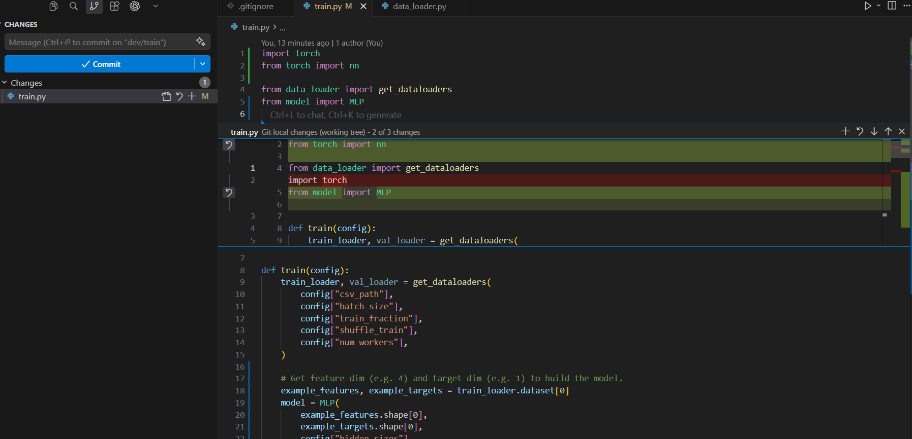
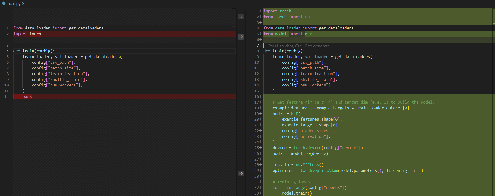
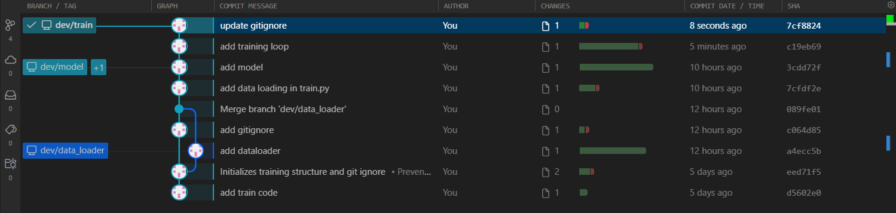
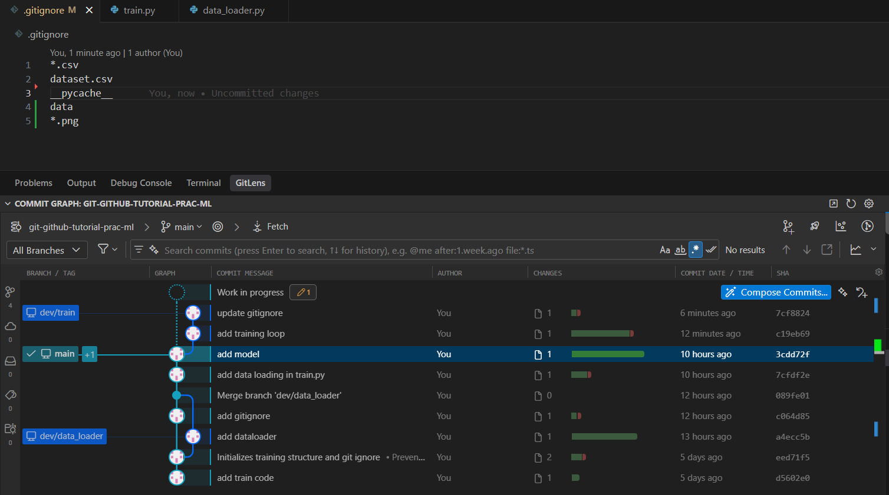
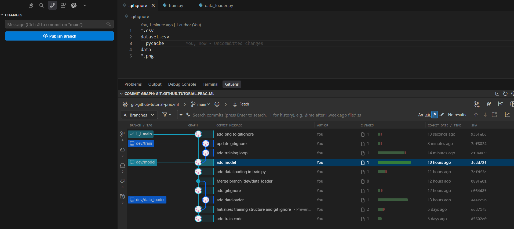
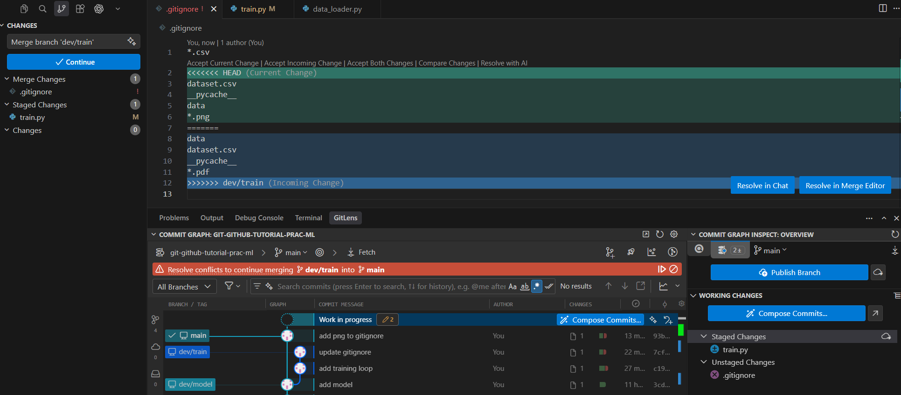
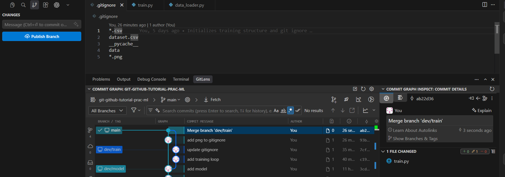

## Background


## Let's make conflict

Let's make an intential conflict


Create a branch for implementing training loop in `train.py`
```shell
git status
git checkout main  # ensure if you are in `main` branch
git checkout -b dev/train
```

This is our update on `train.py`.

```python title="train.py"
import torch
from torch import nn

from data_loader import get_dataloaders
from model import MLP


def train(config):
    train_loader, val_loader = get_dataloaders(
        config["csv_path"],
        config["batch_size"],
        config["train_fraction"],
        config["shuffle_train"],
        config["num_workers"],
    )

    # Get feature dim (e.g. 4) and target dim (e.g. 1) to build the model.
    example_features, example_targets = train_loader.dataset[0]
    model = MLP(
        example_features.shape[0],
        example_targets.shape[0],
        config["hidden_sizes"],
        config["activation"],
    )
    device = torch.device(config["device"])
    model = model.to(device)

    loss_fn = nn.MSELoss()
    optimizer = torch.optim.Adam(model.parameters(), lr=config["lr"])

    # Training looop
    for _ in range(config["epochs"]):
        model.train()
        for batch_features, batch_targets in train_loader:
            batch_features = batch_features.to(device)
            batch_targets = batch_targets.to(device)
            predictions = model(batch_features)  # Forward pass
            loss = loss_fn(predictions, batch_targets)  # Compute loss
            optimizer.zero_grad()  # Clear old gradients
            loss.backward()  # Backprop: compute d(loss)/d(weights).
            optimizer.step()  # Apply the update for this batch.

    return model
```

!!! note
    VS Code shows the changes (before staging)

    
    *Change views in VS Code*

    
    *Diff views in VS Code*

Stage and commit.

```shell
git add train.py
git commit -m "add training loop"
```

At the same time, you also make changes in `.gitignore`

```text title=".gitignore"
*.csv
data
dataset.csv
__pycache__
*.pdf
```

Stage and commit. 

```shell
git add .gitignore
git commit -m "update gitignore"
```



Now, go back to `main` branch, and make the changes at the same lines where you made changes in `dev/train` branch. 

```shell
git checkout main
```

```text title=".gitignore"
*.csv
dataset.csv
__pycache__
data
*.png
```



Commit this change

```shell
git add .
git commit -m "add png to gitignore"
```




Now, you have conflicting changes in `.gitignore` between the two branches:

=== "`dev/train` branch"

    ```text title=".gitignore" hl_lines="2 3 4 5"
    *.csv
    data
    dataset.csv
    __pycache__
    *.pdf
    ```

=== "`main` branch"

    ```text title=".gitignore" hl_lines="2 3 4 5"
    *.csv
    dataset.csv
    __pycache__
    data
    *.png
    ```

Both branches modified the same lines of `.gitignore` differently: the order of `data` and `dataset.csv` is swapped, and each branch added a different new entry (`*.pdf` vs `*.png`). Git cannot decide which version to keep, so it will raise a conflict.


## Merge the conflicting changes

Try merge `dev/train` to `main`

```shell
git status  # check if you are at `main` branch. If not, `git checkout main`
git merge dev/train
```

You will see an error message in your terminal:

```console
$ git merge dev/train
Auto-merging .gitignore
CONFLICT (content): Merge conflict in .gitignore
Automatic merge failed; fix conflicts and then commit the result.
```


*VS Code shows the conflict status*

Resolve the conflict by editing `.gitignore` to the desired final content:

=== "VS Code"
    Open `.gitignore`. VS Code highlights the conflict and shows inline buttons. Click **Accept Current Change**, **Accept Incoming Change**, or **Accept Both Changes** to pick which version to keep, then save.

    

=== "Text editor"
    Open `.gitignore`. You will see conflict markers:

    ```text
    <<<<<<< HEAD
    dataset.csv
    __pycache__
    data
    *.png
    =======
    data
    dataset.csv
    __pycache__
    *.pdf
    >>>>>>> dev/train
    ```

    Manually edit the file to the intended content, removing all conflict markders: `<<<<<<<`, `=======`, and `>>>>>>>`.

After resolving, stage and commit:

```shell
git add .gitignore
git commit -m "resolve merge conflict in .gitignore"
```


