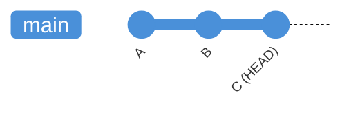
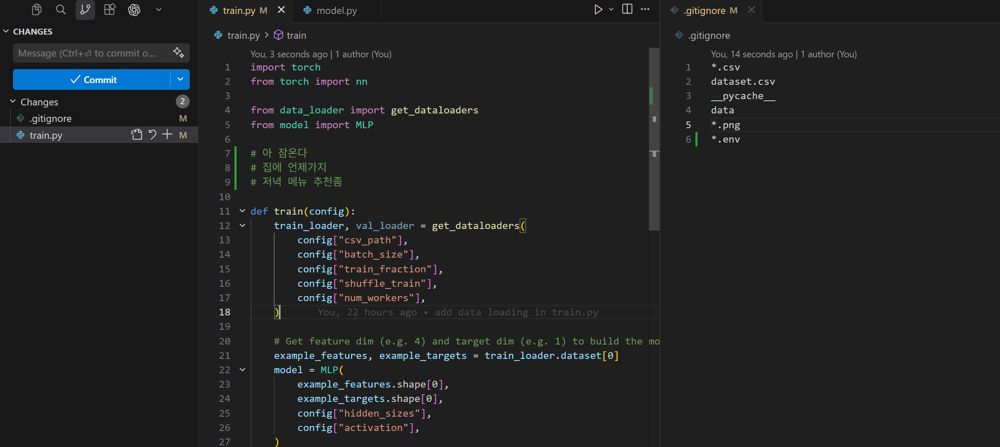
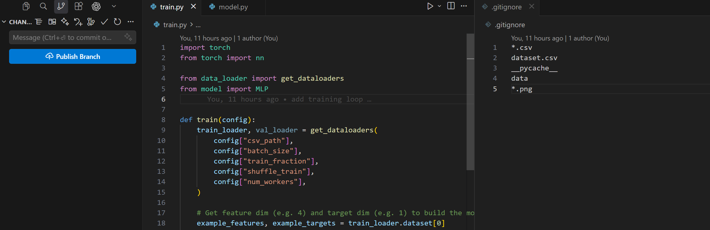
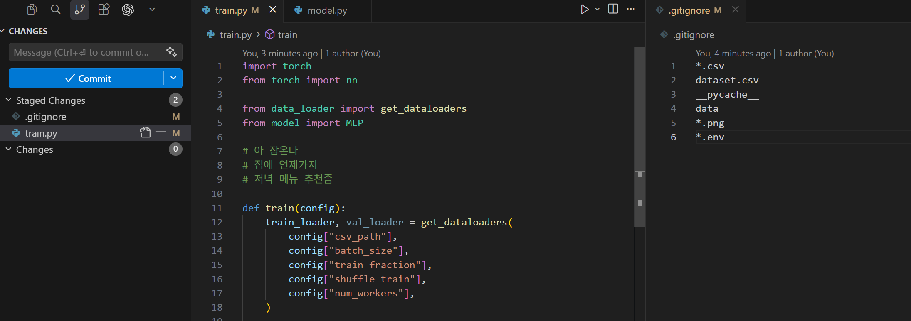
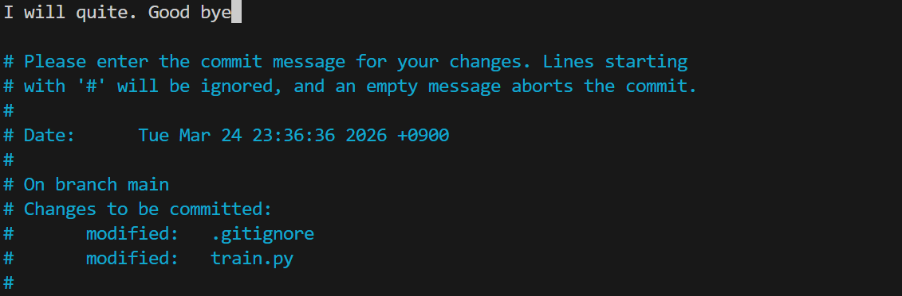
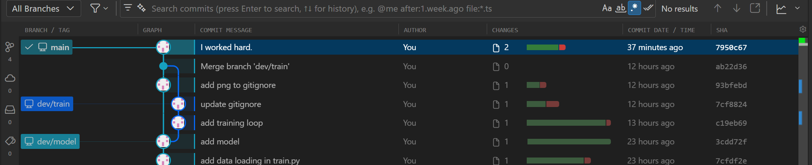
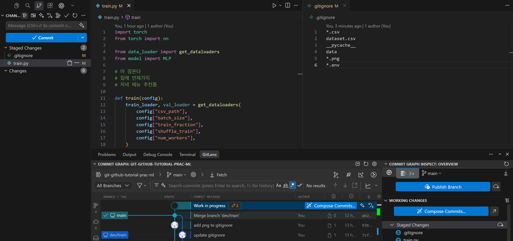
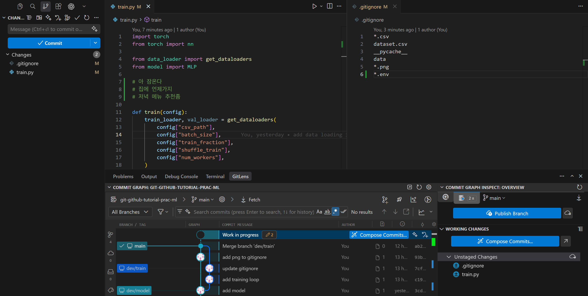
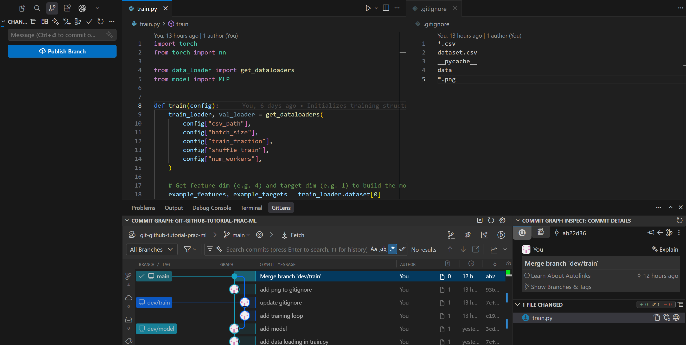
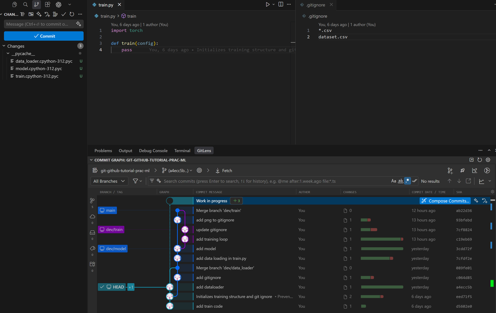

## What is `HEAD`

`HEAD` is a pointer to the **commit you are currently on**, normally the tip of your active branch.



When you make a new commit, `HEAD` moves forward with it.  
When you switch branches, `HEAD` moves to that branch's tip.

!!! info "Detached HEAD"
    If you check out a specific commit directly (`git checkout <hash>`), `HEAD` points to that commit instead of a branch tip. You can look around the file at that commit, but any new commits won't belong to any branch until you create one.

## Undo before a commit

### Unstaged changes

Let's make changes that you don't want to include.



Drop unstaged changes in a file (i.e., removes all unstaged changes).

```shell
# git restore <file>
git restore train.py
# Or, restore all files in your project to the last commit state
git restore .
```

??? "Expand to see VS Code view"
    

### Staged changes

Let's stage (by mistake) the unintended changes:

```shell
git add .
```



You can unstage those:

```shell
# git restore --staged <file>
git restore --staged train.py
git restore --staged .  # unstage all changes. 
```

??? "Expand to see VS Code view"
    


## After commit

Let's commit (by mistake) those unintended changes.

```shell
git add .
git commit -m "I'll quit phd. Good bye"
```

### Fix the last commit (small correction)

To modify the most recent commit (for example, update the commit message or add more staged changes), use `git commit --amend`.  You can revise the commit message or staged files.

`git commit --amend` will open the commit message editor. Here’s what it looks like in nano and vim:

=== "nano (default on many systems)"
    ```shell-session
    $ git commit --amend
    ```
    
    Edit the line `I will quite. Good bye`, then press Ctrl+O Enter to save and Ctrl+X to exit
    

=== "vim"
    ```console
    $ git commit --amend
    ```
    Similarly, edit the line, then `:wq` and `enter` to save and exit.
    

=== "VS Code"
    Edit the line, and just save (like `ctrl+s`) and close the file. 


After finishing `amend`, you see the changed commit.



!!! warning
    Don't amend a commit if you've already pushed your branch to a shared remote branch.

!!! note
    In the above example, we only amended the commit message, but you can also amend any files, stage again, commit with different message.

### Undo commits

Use `git reset` to move `HEAD` (and the branch pointer) back to a previous commit.

```shell
git reset <mode> <commit-hash>
# Example:
git reset ab22d36
```

| Mode | Staging area | Working directory |
|------|-------------|-------------------|
| `--soft` | keeps changes staged | unchanged |
| `--mixed` *(default)* | unstages changes | unchanged |
| `--hard` | clears staging area | **discards all changes** |

#### Soft
Reverted changes remain in your *staging area* (ready to commit again).

```shell
git reset --soft HEAD~1     # Undo last commit, keep changes staged
git reset --soft <hash>     # Undo up to that commit, keep all reverted changes staged
```

For example, use this if you want to revise several recent commits into a new one.




#### Mixed (default)
Reverted changes remain in your *working directory* as unstaged modifications.

```shell
git reset HEAD~1            # Undo last commit, unstage changes
git reset <hash>            # Undo up to that commit, unstage all reverted changes
# Or, git reset --mixed
```

For example, use this if you want to selectively re-stage and re-commit only some of the reverted changes.



#### Hard
Reverted changes are **permanently lost** from both the staging area and working directory.

```shell
git reset --hard HEAD~1     # Undo last commit, discard all changes
git reset --hard <hash>     # Undo up to that commit, permanently discard all reverted changes
```

For example, use this when you want to completely throw away recent commits and start clean.


!!! warning
    Don't `hard` reset if you are working on a shared branch. Use `revert` below.



### Revert

`git revert` creates a **new commit** that undoes a previous one. That is safe for shared/remote branches.

```shell
git revert <commit-hash>                        # undo a specific commit
git revert HEAD                                 # undo the latest commit
git revert -n <commit-hash-A>..<commit-hash-B>  # undo multiple subsequent commits
```

<!-- TODO: add VS Code screenshot for git revert -->

!!! note
    Unlike `reset`, `revert` does not rewrite history, so it is safe to push to a shared remote branch.


### Browse an old version

```shell
git checkout <commit-hash>
# Or
git switch --detach <commit-hash>
git switch main  # return back
```




