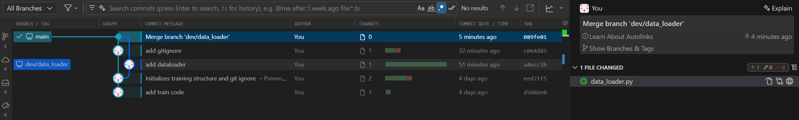
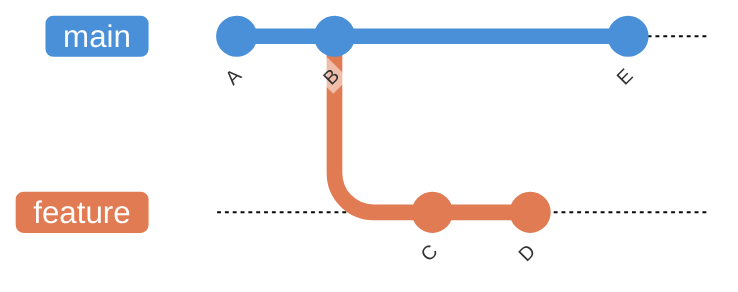
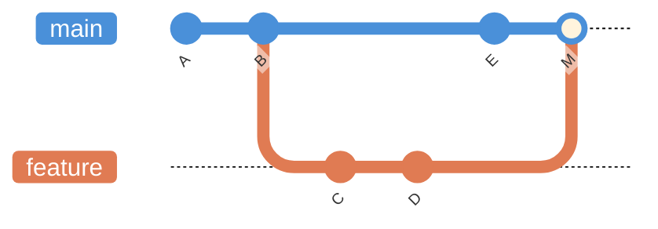
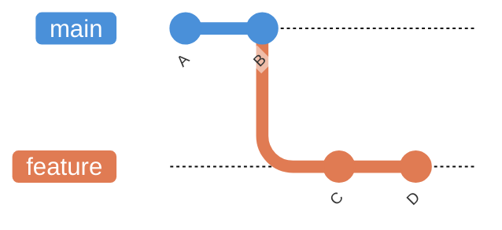
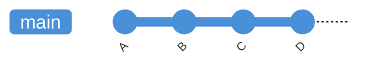

## Merge a branch

If we finish developing in our branch (e.g., `dev/data_loader`), we can merge it into our `main` branch.

```shell
git checkout main  # Move to master branch
git pull origin main  # If you are coworking through github, pull any new remote changes
git branch --merged  # List out the branches we have merged to date
git merge dev/data_loader  # Merge in our branch
git push origin main  # Push our changes to master
git branch --merged  # Note new newly merged branch has been added
git log --graph --oneline  # see commit history as graph
```

!!! warning
    If both `main` and your merging branch (e.g., `dev/data_loader`) have changes to the same lines of code, Git will encounter a merge conflict and display an error message. You will need to resolve these conflicts before completing the merge. You can do it manually, or with VS Code supporting GUI. See [this page](conflict.md) 





!!! tip 
    After merging, you may remove the branch if you don't want to keep it.
    ```shell
    git branch -d dev/data_loader  # Remove the local branch that was just merged
    git push origin --delete dev/data_loader  # Remove the branch from the remote as well
    ```


Check status and keep developing

```shell
git status  # check status
```

Make updates and `stage`, `commit`.

## Types of merge

When you run `git merge`, Git decides which strategy to use based on the shape of the commit history. The two most common outcomes are a **fast-forward merge** and a **regular (3-way) merge**.


### Regular (3-way) merge

A regular merge is needed when **both branches have new commits** since they diverged. Git finds the common ancestor, compares the two branch tips against it, and combines the changes into a new **merge commit** with two parents.

Before merge, `main` and `feature` have diverged:



After `git merge feature` on `main`, a merge commit `M` joins the two histories:



```shell
git checkout main
git merge feature   # creates a merge commit M
```

The merge commit `M` records both parent branches, so you can always trace back to see where the feature was developed.

!!! note
    If you prefer to always create a merge commit (even when a fast-forward is possible), use `git merge --no-ff feature`. This preserves the branch topology in the history, making it easier to see that a group of commits belonged to a feature branch.


### Fast-forward merge

A fast-forward merge happens when the target branch (e.g., `main`) has received **no new commits** since you branched off. In other words, your feature branch is directly ahead of `main`.



Because there is no divergence, Git simply moves the `main` pointer forward to the latest commit on `feature`, so no extra merge commit is created.



```shell
git checkout main
git merge feature          # fast-forward (default when possible)
# Or, to be explicit:
git merge --ff-only feature  # fails if fast-forward is not possible
```

!!! tip
    Use `--ff-only` when you *want* to guarantee a linear history. If the branches have diverged, the command will fail instead of silently creating a merge commit.


### Quick comparison

| | Fast-forward | Regular (3-way) |
|---|---|---|
| **When** | Target branch has no new commits | Both branches have new commits |
| **Merge commit** | No | Yes |
| **History shape** | Linear | Shows branch and merge |
| **Command** | `git merge` or `git merge --ff-only` | `git merge` or `git merge --no-ff` |
