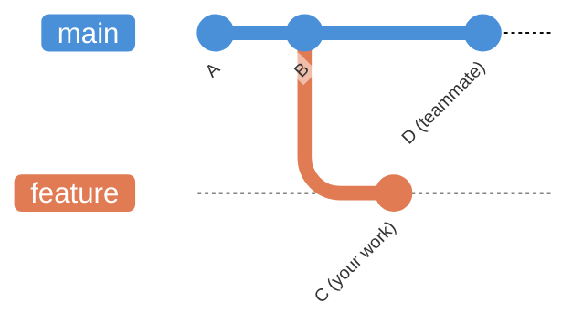
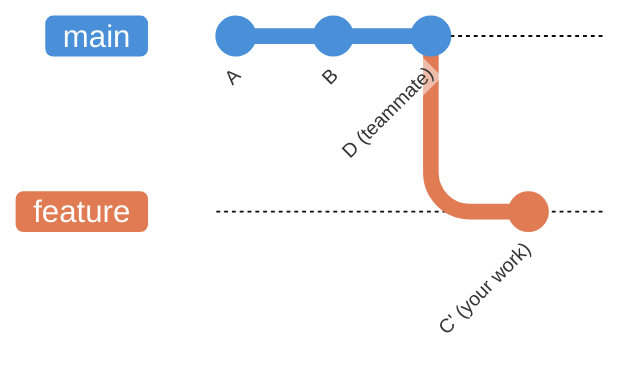
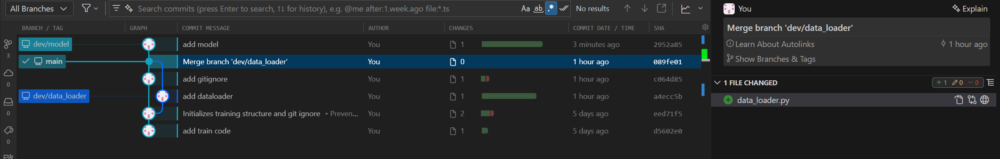
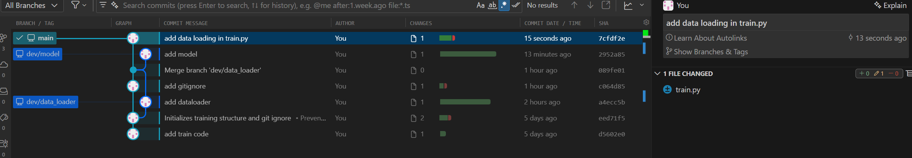
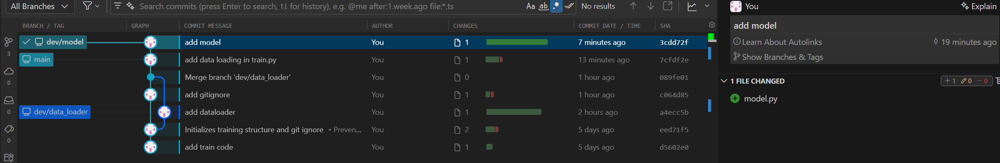
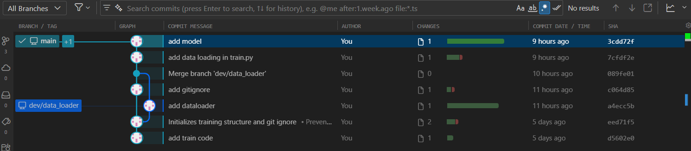
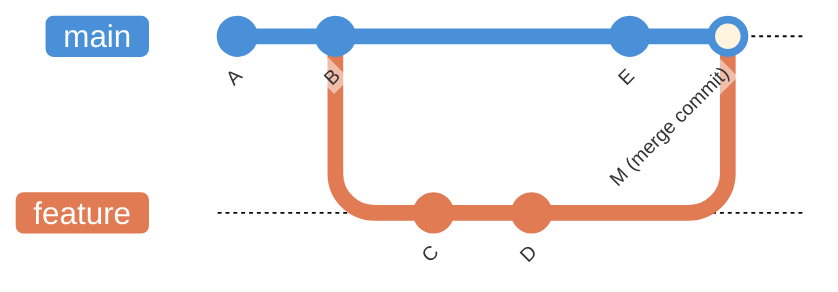
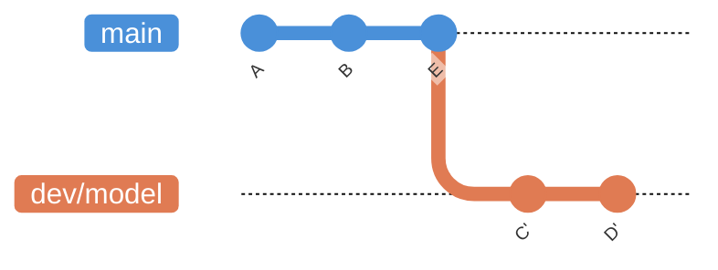

## What is rebase?

Imagine you created a feature branch from `main` and started working. Meanwhile, your teammate pushed new commits to `main`. Now your branch is based on an outdated version of `main`.

You have two options to catch up:

- **Merge** `main` into your branch: it works, but creates an extra merge commit every time you sync.
- **Rebase** your branch onto `main`: Git picks up your commits and replays them on top of the latest `main`, as if you just started the branch today.



After running `git rebase main` on `feature`, your commit `C` is replayed on top of `D`:



The result is a clean, linear history, without extra merge commits cluttering the log.

```shell
git checkout feature
git rebase main        # replay feature commits on top of main
```

!!! warning
    Rebase rewrites commit hashes (`C` becomes `C'`). Never rebase commits that have already been pushed and shared with others.

## Make changes to the project

Let's develop a neural network model `model.py`.

```shell
git status  # check if you are in `main` branch
git checkout -b dev/model  # create `dev/model` branch and switch to the new branch
```

Write `model.py`

```python title="model.py"
import torch.nn as nn


class MLP(nn.Module):
    """Fully-connected network for regression or classification.

    Stacks linear layers with the same activation after each hidden layer.
    The final layer has no activation.
    """

    def __init__(self, input_dim, output_dim, hidden_sizes, activation):
        """Builds the MLP.

        Args:
            input_dim: Size of the input feature vector.
            output_dim: Size of the output (e.g. 1 for scalar regression).
            hidden_sizes: Iterable of hidden layer widths, in order.
            activation: Callable with no arguments that returns an activation
                module instance, e.g. ``nn.ReLU``, ``nn.Tanh``, ``nn.GELU``,
                ``nn.SiLU``, ``nn.LeakyReLU``, ``nn.ELU``, ``nn.Mish``.
        """
        super().__init__()
        layers = []
        in_d = input_dim
        for h in hidden_sizes:
            layers.append(nn.Linear(in_d, h))
            layers.append(activation())
            in_d = h
        layers.append(nn.Linear(in_d, output_dim))
        self.net = nn.Sequential(*layers)

    def forward(self, x):
        """Runs the forward pass.

        Args:
            x: Input tensor of shape ``(batch, input_dim)``.

        Returns:
            Output tensor of shape ``(batch, output_dim)``.
        """
        return self.net(x)
```

## Stage and commit the changes

```shell
git add model.py
git commit -m "add model"
```

Now, suppose that a change has also been made to the `main` branch. To illustrate this scenario, we will simulate a change in `main`.


```shell
git status
git checkout main           # Switch to main using checkout
# Or, using the modern command:
git switch main             # Switch to main using switch
```




!!! note
    You won't see `model.py` in your project files after switching the branch to `main`, since you developed `model.py` in `dev/model` branch.

Make changes in `train.py`. Here, we implement data loading.

```python title="train.py"
from data_loader import get_dataloaders
import torch

def train(config):
    train_loader, val_loader = get_dataloaders(
        config["csv_path"],
        config["batch_size"],
        config["train_fraction"],
        config["shuffle_train"],
        config["num_workers"],
    )
    pass
```

Stage and commit.

```
git add train.py
git commit -m "add data loading in train.py"
```



## Rebase: keep your feature branch up-to-date
Now let's incorporate the changes from the `main` branch into your feature branch (`dev/model`) using rebase. In the shell, you would do:

```shell
git checkout dev/model      # Switch back to your feature branch
# Or using the modern command:
git switch dev/model

git rebase main             # Replay your feature branch commits on top of the latest main
```

This will "replay" your work from `dev/model` on top of the updated `main` branch. 



This is useful when you want to keep your feature branch up-to-date with the latest changes from `main` and maintain a linear project history.

!!! warning
    If there are any conflicts between the changes in `main` and `dev/model` branches, Git will pause and ask you to resolve them before continuing (`git rebase --continue` after fixing conflicts).


## Merge into `main`: fast-forward

After rebase, `dev/model` is directly ahead of `main` with no divergence, so Git can advance `main` to `dev/model'` without creating a merge commit:

```shell
git checkout main
git merge --ff-only dev/model    # fast-forward: no merge commit
# Or,
git dev/model  
```

!!! note
    Both `git merge` and `git merge --ff-only` produce the same result here since `dev/model` is directly ahead of `main`. Prefer `--ff-only` to guard against accidental merge commits if the branches have diverged unexpectedly.





## Rebase vs. Merge

**Merge** adds a merge commit that joins two histories; the feature branch keeps its original commits, and the graph shows a fork that came back together.




**Rebase** replays your feature commits on top of the target branch. `main` stays at `E`; only `dev/model` moves forward to `D'`. Commit hashes change, so avoid rebasing commits already pushed and shared with others.


