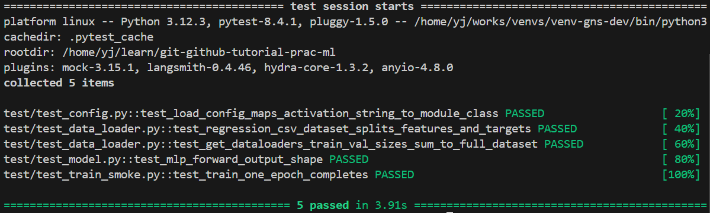
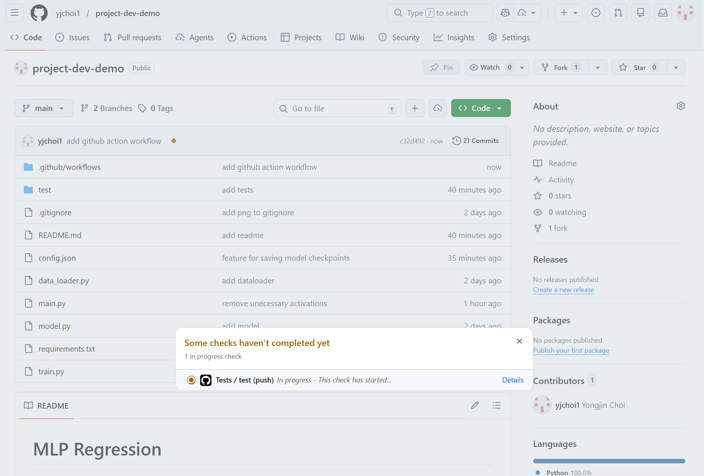
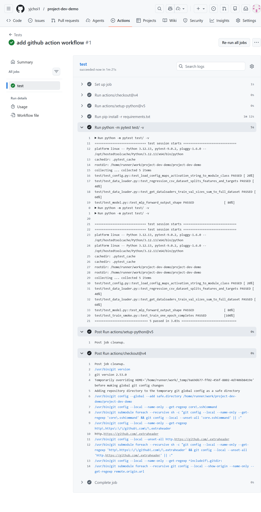

# Automated Testing with GitHub Actions

Suppose you have a test suite for your project. Whenever a collaborator makes changes and opens a Pull Request (PR), you want to ensure their code passes all tests before merging.

**GitHub Actions** allows you to automatically run your tests (e.g., `pytest`) every time code is pushed or a PR is created.

### Reference Examples
- [Demo Repository with Test Code](https://github.com/yjchoi1/project-dev-demo)
- [GitHub Actions Workflow Setup (`tests.yml`)](https://github.com/yjchoi1/project-dev-demo/blob/main/.github/workflows/tests.yml)

---

### How it Works

**1. Local Testing**  
You write and run tests locally using tools like `pytest`.
```shell
pytest test
```


**2. Automated Trigger**  
When code is pushed to GitHub, the workflow is automatically triggered.


**3. Action Details**

When you open a Pull Request or push new commits, GitHub Actions runs your test workflow and displays easy-to-spot colored status markers:

- 🟢 **Green check:** All tests passed—code is safe to merge!
- 🟡 **Yellow dot:** Tests are running or in progress.
- 🔴 **Red x:** Some tests failed—you should review and fix the errors before merging.



