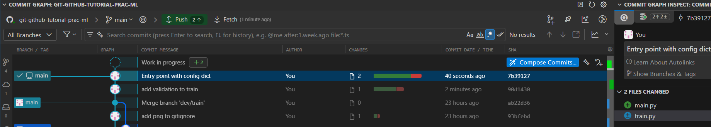
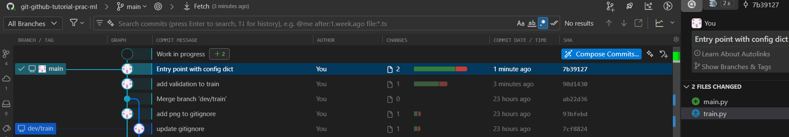
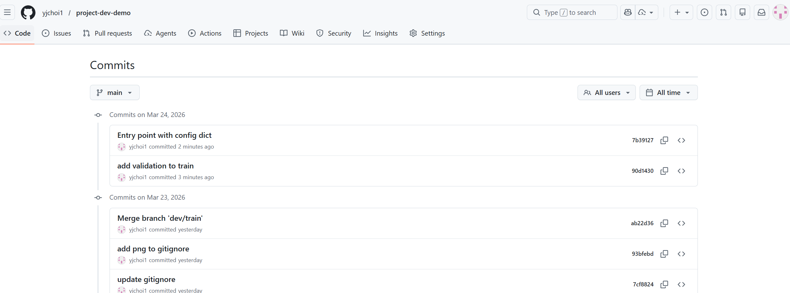
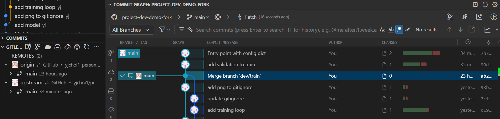
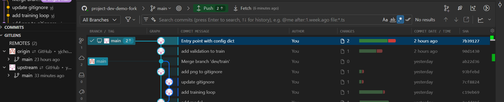

Let's say your `upstream` has made new updates (commits) 

??? "Your "boss" made changes in `upstream` repo"
    ??? "Commit: add validation to train"

        ```python title="train.py"
        import torch
        from torch import nn

        from data_loader import get_dataloaders
        from model import MLP


        def train(config):
            train_loader, val_loader = get_dataloaders(
                config["csv_path"],
                config["batch_size"],
                config["train_fraction"],
                config["shuffle_train"],
                config["num_workers"],
            )

            # Get feature dim (e.g. 4) and target dim (e.g. 1) to build the model.
            example_features, example_targets = train_loader.dataset[0]
            model = MLP(
                example_features.shape[0],
                example_targets.shape[0],
                config["hidden_sizes"],
                config["activation"],
            )
            device = torch.device(config["device"])
            model = model.to(device)

            loss_fn = nn.MSELoss()
            optimizer = torch.optim.Adam(model.parameters(), lr=config["lr"])

            # Training loop
            for epoch in range(config["epochs"]):
                model.train()
                train_loss = 0.0
                for batch_features, batch_targets in train_loader:
                    batch_features = batch_features.to(device)
                    batch_targets = batch_targets.to(device)
                    predictions = model(batch_features)
                    loss = loss_fn(predictions, batch_targets)
                    optimizer.zero_grad()
                    loss.backward()
                    optimizer.step()
                    train_loss += loss.item() * len(batch_features)
                train_loss /= len(train_loader.dataset)

                model.eval()
                val_loss = 0.0
                with torch.no_grad():
                    for batch_features, batch_targets in val_loader:
                        batch_features = batch_features.to(device)
                        batch_targets = batch_targets.to(device)
                        predictions = model(batch_features)
                        loss = loss_fn(predictions, batch_targets)
                        val_loss += loss.item() * len(batch_features)
                val_loss /= len(val_loader.dataset)

                print(f"Epoch {epoch + 1}/{config['epochs']}  train_loss={train_loss:.4f}  val_loss={val_loss:.4f}")

            return model
        ```

    ??? "Commit: Entry point with config dict"

        ```python title="train.py"
        import torch
        from torch import nn

        from data_loader import get_dataloaders
        from model import MLP


        def train(config):
            data_cfg = config["data"]
            model_cfg = config["model"]
            train_cfg = config["training"]

            train_loader, val_loader = get_dataloaders(
                data_cfg["csv_path"],
                data_cfg["batch_size"],
                data_cfg["train_fraction"],
                data_cfg["shuffle_train"],
                data_cfg["num_workers"],
            )

            # Get feature dim (e.g. 4) and target dim (e.g. 1) to build the model.
            example_features, example_targets = train_loader.dataset[0]
            model = MLP(
                example_features.shape[0],
                example_targets.shape[0],
                model_cfg["hidden_sizes"],
                model_cfg["activation"],
            )
            device = torch.device(train_cfg["device"])
            model = model.to(device)

            loss_fn = nn.MSELoss()
            optimizer = torch.optim.Adam(model.parameters(), lr=train_cfg["lr"])

            # Training loop
            for epoch in range(train_cfg["epochs"]):
                model.train()
                train_loss = 0.0
                for batch_features, batch_targets in train_loader:
                    batch_features = batch_features.to(device)
                    batch_targets = batch_targets.to(device)
                    predictions = model(batch_features)
                    loss = loss_fn(predictions, batch_targets)
                    optimizer.zero_grad()
                    loss.backward()
                    optimizer.step()
                    train_loss += loss.item() * len(batch_features)
                train_loss /= len(train_loader.dataset)

                model.eval()
                val_loss = 0.0
                with torch.no_grad():
                    for batch_features, batch_targets in val_loader:
                        batch_features = batch_features.to(device)
                        batch_targets = batch_targets.to(device)
                        predictions = model(batch_features)
                        loss = loss_fn(predictions, batch_targets)
                        val_loss += loss.item() * len(batch_features)
                val_loss /= len(val_loader.dataset)

                print(f"Epoch {epoch + 1}/{train_cfg['epochs']}  train_loss={train_loss:.4f}  val_loss={val_loss:.4f}")

            return model
        ```

        ```python title="main.py"
        import torch.nn as nn

        from train import train

        config = {
            "data": {
                "csv_path": "data/dataset.csv",
                "train_fraction": 0.8,
                "batch_size": 32,
                "shuffle_train": True,
                "num_workers": 0,
            },
            "model": {
                "hidden_sizes": [64, 64],
                "activation": nn.ReLU,
            },
            "training": {
                "epochs": 50,
                "lr": 1e-3,
                "device": "cpu",
            },
        }

        if __name__ == "__main__":
            model = train(config)
        ```

    

    Push your new local updates to remote
    ```shell
    git remote -v  # see what is your remote
    git push origin main  # push your changes to remote
    ```

    

    See your remote commit history at github.

    

## Fetch

Now, you want to get updates about what has been changed in the `upstream` in your local project (linked to your forked remote).


```shell
git remote add upstream https://github.com/yjchoi1/project-dev-demo.git  # Add upstream to remote
git remote -v
git fetch upstream  # Fetch latest changes from upstream
```




## How to pull the fetched upstream changes into your branch

To merge changes from upstream's main branch into your local main:

```shell
git checkout main                    # Switch to your main branch
git fetch upstream                   # Fetch latest changes from upstream
git merge upstream/main              # Merge upstream's main into your local main
```

Or, combine fetch and merge in a single `pull` command:

```shell
git pull upstream main               # Fetch and merge upstream/main into your current branch
```




!!! tip "Best practice"

    Before starting work, always `pull` remote first to make your local `main` up-to-date; if someone made update to remote `main`, your local branch might out-dated. This will cause merge conflict later when you open a PR.

    ```shell
    git checkout main
    git pull                  # sync with remote
    git checkout -b dev/my-feature   # start a fresh branch
    ```

    **Without pull first:** your branch is based on stale `main`, diverging from what a teammate already pushed:

    ```mermaid
    %%{init: {'theme': 'base', 'themeVariables': {'git0': '#4A90D9', 'git1': '#E07B53', 'gitBranchLabel0': '#ffffff', 'gitBranchLabel1': '#ffffff', 'commitLabelColor': '#333333', 'commitLabelBackground': '#ffffff'}} }%%
    gitGraph
    commit id: "A"
    commit id: "B"
    branch dev/my-feature
    checkout dev/my-feature
    commit id: "my work"
    checkout main
    commit id: "C (teammate)" type: HIGHLIGHT
    ```

    **With pull first:** your branch starts from the latest `main`, so no unexpected conflicts:

    ```mermaid
    %%{init: {'theme': 'base', 'themeVariables': {'git0': '#4A90D9', 'git1': '#E07B53', 'gitBranchLabel0': '#ffffff', 'gitBranchLabel1': '#ffffff', 'commitLabelColor': '#333333', 'commitLabelBackground': '#ffffff'}} }%%
    gitGraph
    commit id: "A"
    commit id: "B"
    commit id: "C (teammate)"
    branch dev/my-feature
    checkout dev/my-feature
    commit id: "my work"
    ```


If you want to update your remote `origin`, 

```shell
git remote -v  # check which remotes that you currently have
git push origin main  # push your changes to remote
```


## Git `pull` with `rebase`

The above example is straight forward. Only "boss" made a change in `upstream`, so we could just fast-forward merge.

However, when both you and the boss have added commits, a regular `git pull` creates an extra **merge commit**, making the history look branchy. `--rebase` avoids this by replaying your commits on top of the upstream's, keeping history **clean and linear**.

=== "`git pull` (merge)"


    ```shell
    git pull upstream main
    ```

    ```mermaid
    %%{init: {'theme': 'base', 'themeVariables': {'git0': '#4A90D9', 'git1': '#E07B53', 'gitBranchLabel0': '#ffffff', 'gitBranchLabel1': '#ffffff', 'commitLabelColor': '#333333', 'commitLabelBackground': '#ffffff'}} }%%
    gitGraph LR:
       commit id: "A (shared)"
       branch upstream/main
       commit id: "B (boss)"
       checkout main
       commit id: "C (yours)"
       merge upstream/main id: "M (merge commit)" type: HIGHLIGHT
    ```

=== "`git pull --rebase`"

    ```shell
    git pull --rebase upstream main
    ```

    ```mermaid
    %%{init: {'theme': 'base', 'themeVariables': {'git0': '#4A90D9', 'git1': '#E07B53', 'gitBranchLabel0': '#ffffff', 'gitBranchLabel1': '#ffffff', 'commitLabelColor': '#333333', 'commitLabelBackground': '#ffffff'}} }%%
    gitGraph LR:
       commit id: "A (shared)"
       commit id: "B (boss)"
       commit id: "C' (yours, replayed)"
    ```

