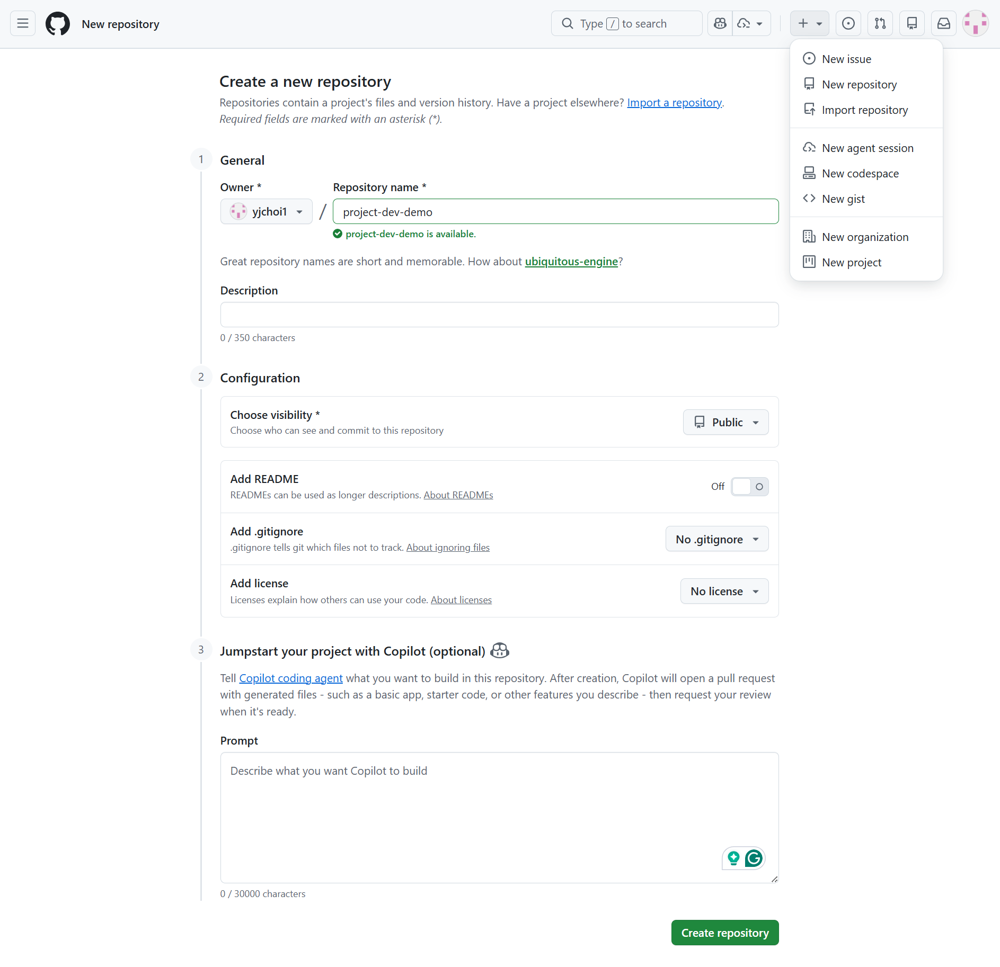
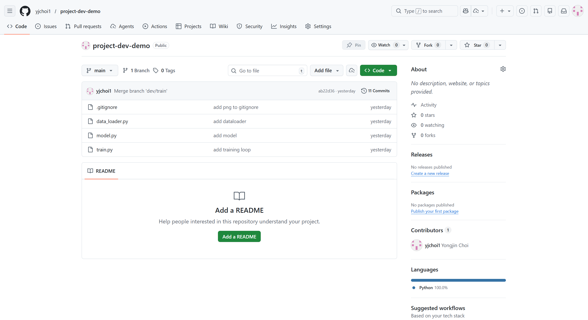

## Create a remote repository




## Link to your local project

```shell
git remote -v  # view status of your remote repository
git remote add origin <replace-to-your-repo-url>
# git remote add origin https://github.com/yjchoi1/project-dev-demo.git
git remote -v 
git branch -M main  # optional
git push -u origin main  # push your local repo to 
```



