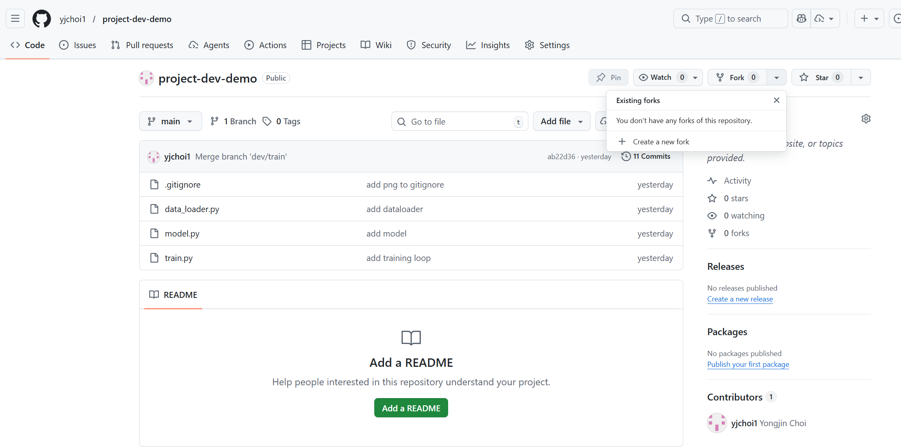
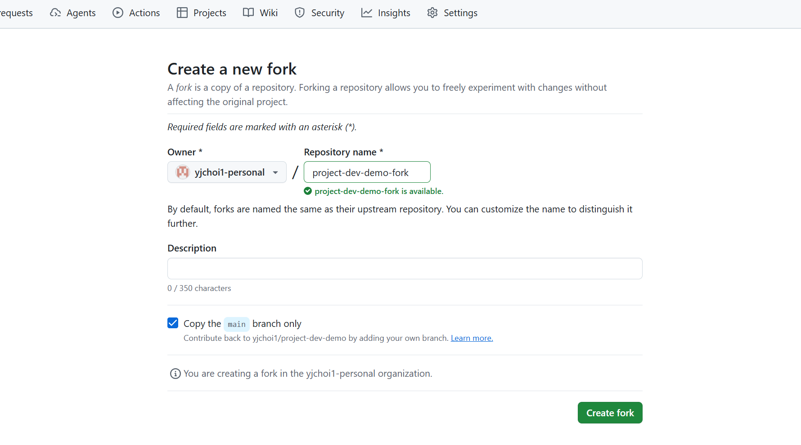
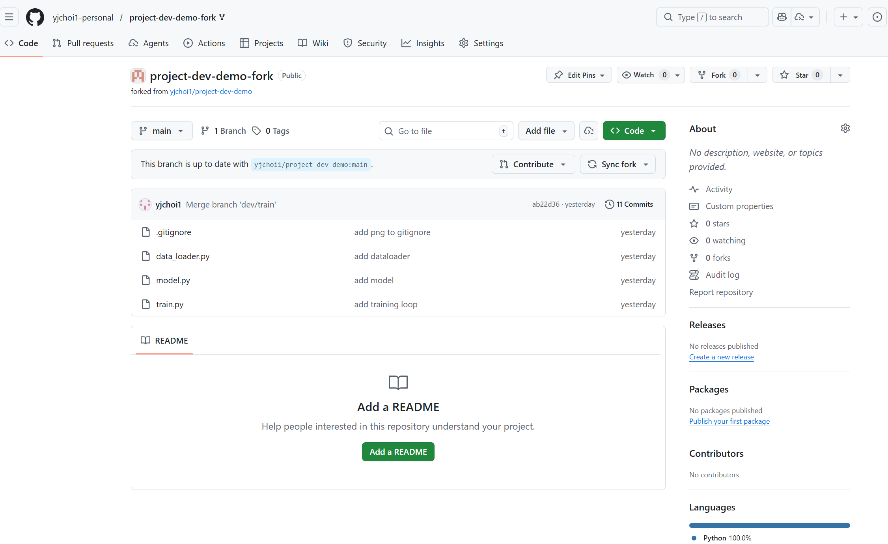
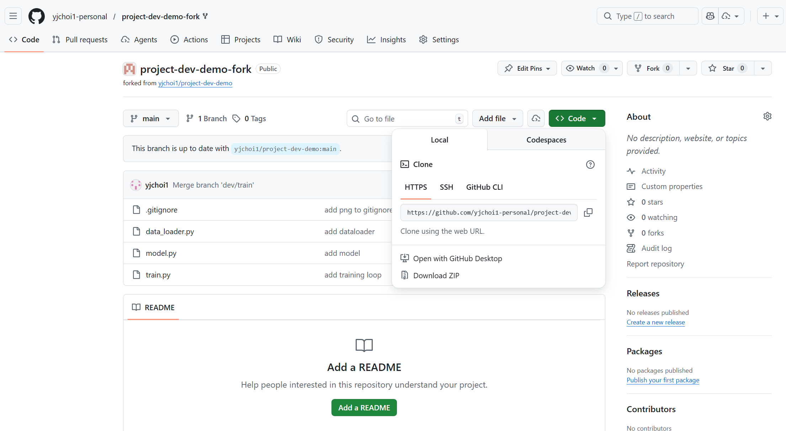
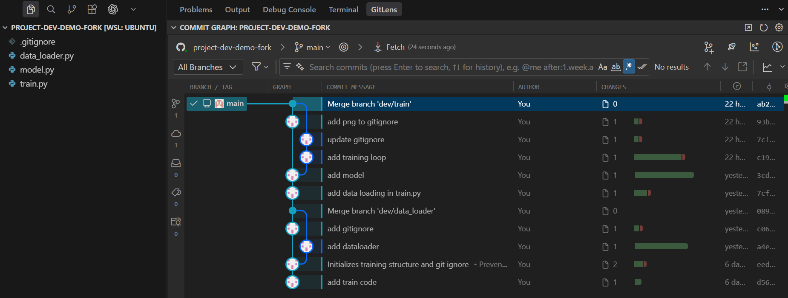

## Fork

!!! note "For this exercise"
    Since GitHub doesn't allow forking a repository to the same account, **create a new organization** to act as a different contributor. This setup lets you practice the standard cross-account collaboration workflow.

Click the `Fork` button on the GitHub project page.



This creates a copy of the project under your GitHub account.




Your fork is independent from the `original` (`upstream`), but stays aware of its changes.




!!! note "Conventions: `origin` and `upstream`"
    **`origin` (Your Fork)**
    
    - `origin` refers to **your personal fork** on GitHub.
    - Example:
        ```
        origin → https://github.com/yjchoi1-personal/project-dev-demo-fork.git
        ```

    **`upstream` (The Original Repository)**

    - `upstream` is a **conventional** name (not built into Git) for the **original repository** you forked from.
    - You usually add `upstream` manually in your local Git repository:
        ```bash
        git remote add upstream https://github.com/ORIGINAL_OWNER/project-dev-demo.git
        ```
    - This helps you keep track of updates from the source project.


## Clone

Copy the repository URL from your fork.



Then clone it to your local machine.

```shell
cd <your-project-parent-directory>
git clone <fork-url>
# git clone https://github.com/yjchoi1-personal/project-dev-demo-fork.git
```

Your local copy is now linked to your forked remote.



See which remote is linked to your local project.

```shell
git remote -v
```
