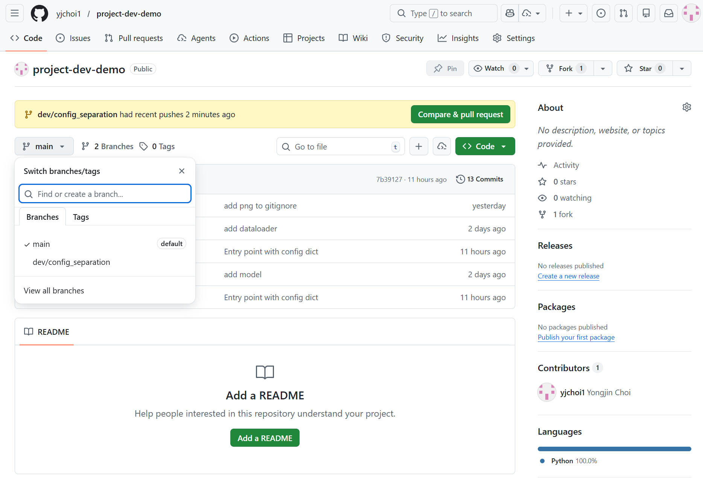
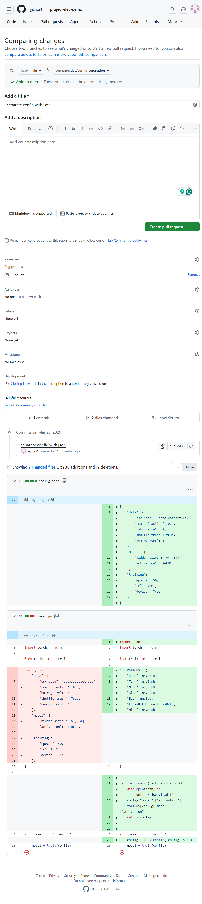
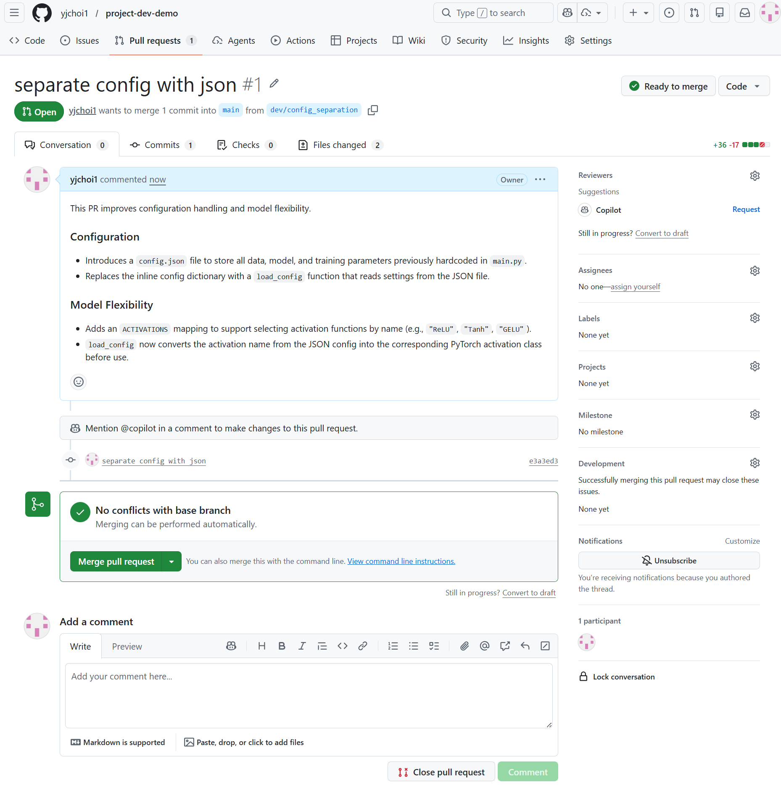
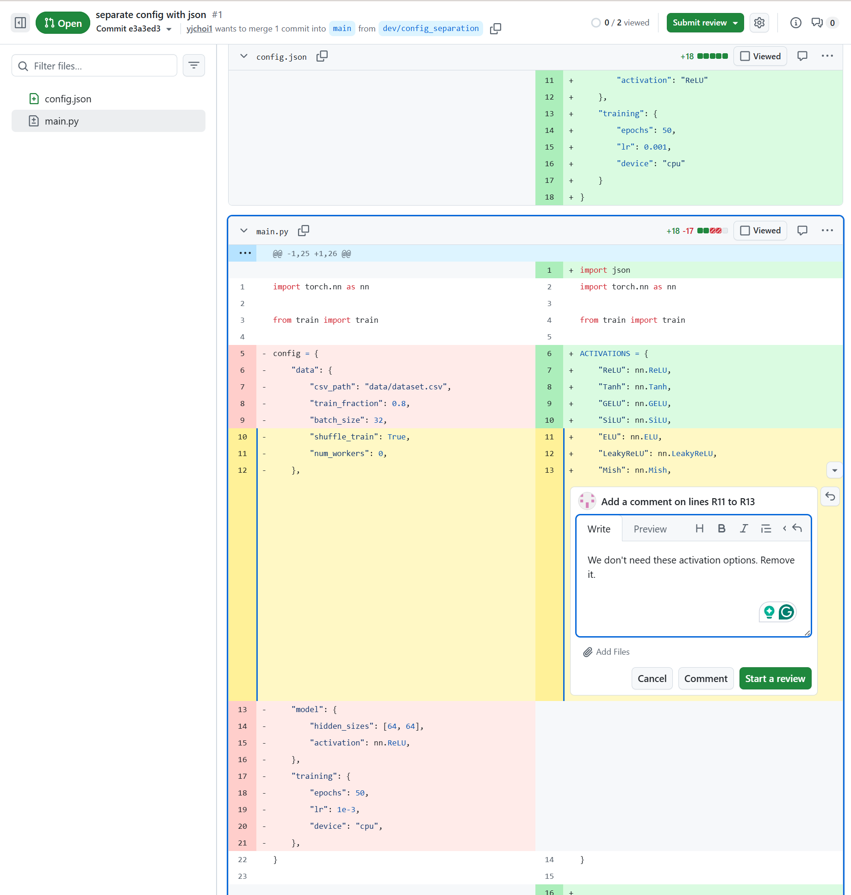
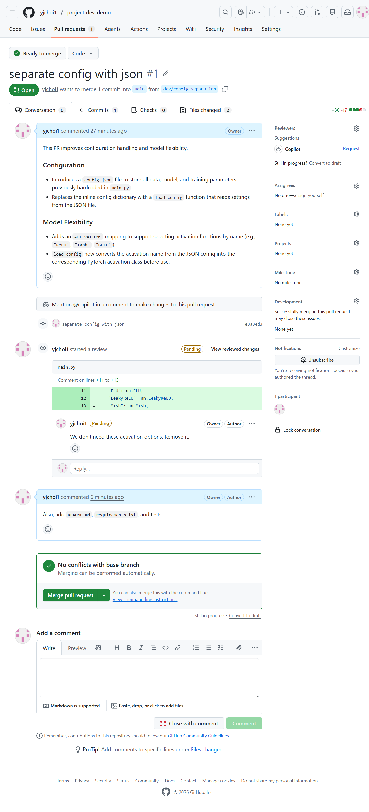
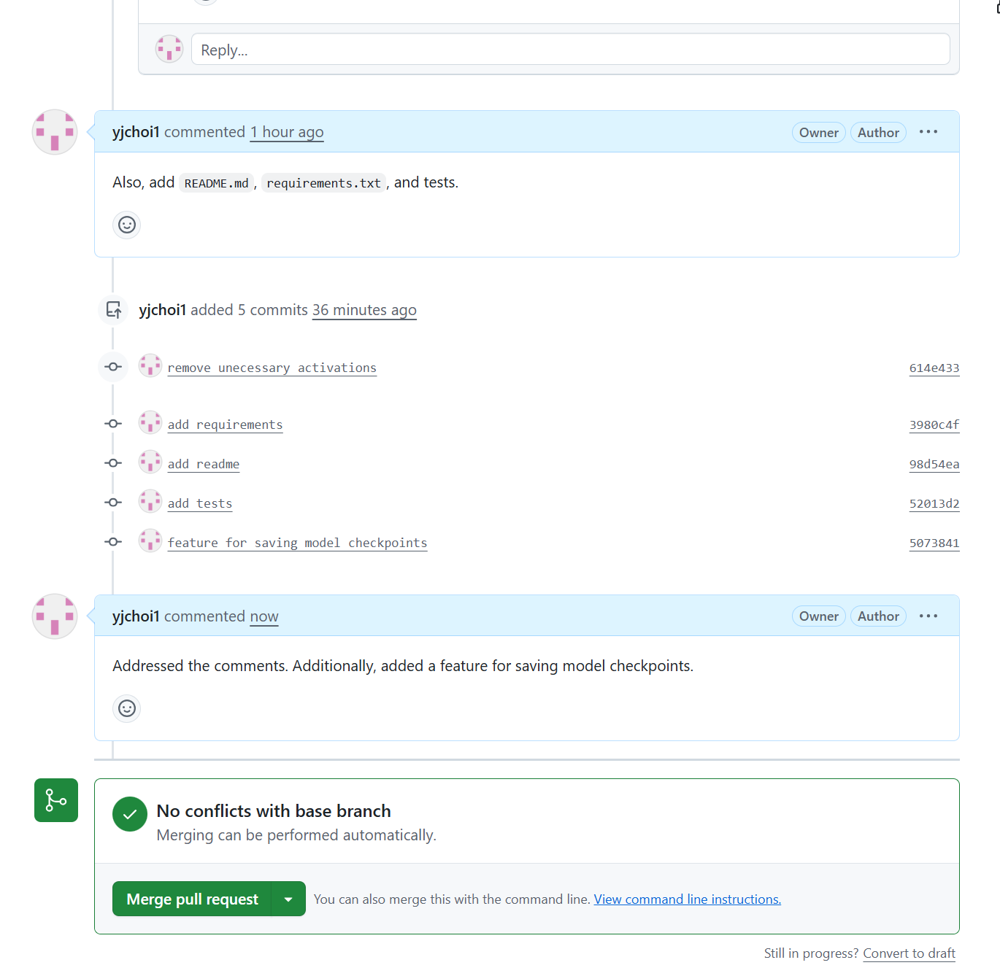
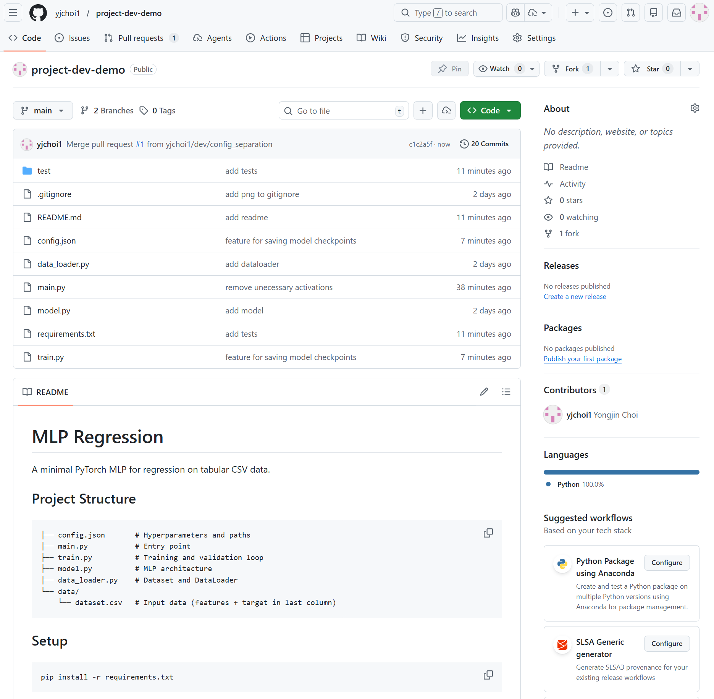
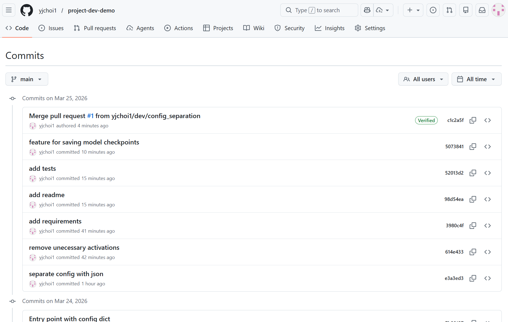

## Background

You've made changes and committed them locally. Now you want to share them with your collaborators: let them see the changes, review, discuss, and decide what to accept. This is what a **pull request (PR)** is for.

There are two standard workflows:

| Workflow | When to use |
|---|---|
| **Branch-based PR** | You have write access to the repo (e.g., team member). Create a feature branch, push it, open a PR to `main`. |
| **Fork-based PR** | You don't have write access (e.g., open-source contributor). Fork → change → open PR to upstream. |

---

## How to pull request (PR)

### Branch-based PR

The following shows a typical workflow for PR.

Here, we assume scenario where you directly `clone` the `upstream` without `fork`.

```shell
# Assume you start fresh from a remote `upstream`
# git clone <github-url>
git clone https://github.com/yjchoi1/project-dev-demo.git
```

#### Create and switch to a new `dev/config_separation` branch:
```shell
# make sure your are in `main` branch
git status 
git checkout main
# Create and switch to a new `dev/config_separation` branch
git checkout -b dev/config_separation
```

#### Update the local code

??? "Expand to see the updated code"
    
    ```python title="main.py (changed)"
    import json
    import torch.nn as nn

    from train import train

    ACTIVATIONS = {
        "ReLU": nn.ReLU,
        "Tanh": nn.Tanh,
        "GELU": nn.GELU,
        "SiLU": nn.SiLU,
        "ELU": nn.ELU,
        "LeakyReLU": nn.LeakyReLU,
        "Mish": nn.Mish,
    }


    def load_config(path: str) -> dict:
        with open(path) as f:
            config = json.load(f)
        config["model"]["activation"] = ACTIVATIONS[config["model"]["activation"]]
        return config


    if __name__ == "__main__":
        config = load_config("config.json")
        model = train(config)
    ```

    ```json title="config.json (new)"
    {
        "data": {
            "csv_path": "data/dataset.csv",
            "train_fraction": 0.8,
            "batch_size": 32,
            "shuffle_train": true,
            "num_workers": 0
        },
        "model": {
            "hidden_sizes": [64, 64],
            "activation": "ReLU"
        },
        "training": {
            "epochs": 50,
            "lr": 0.001,
            "device": "cpu"
        }
    }

    ```

#### Commit your changes:

```shell
git add main.py config.json
git commit -m "separate config with json"
```

#### Push your feature branch to the remote (not main)

```shell
# git push origin <your-branch-name>
git push origin dev/config_separation
```



#### Then, open a Pull Request (PR):

1. Go to your repository on GitHub.
2. You will see a prompt to “Compare & pull request”. Click it.
3. Review the changes and submit the PR targeting the main project.



#### Write the PR description and hit `Create pull request`



!!! tip
    You can ask github `Copliot` to review your PR. It will leave comments for bugs, security issues, code quality, and style issues. 


#### Review the code & request changes



#### Comments view of the PR




#### Revise PR

Make changes in your local branch `dev/config_separation`, commit, push again with `git push origain dev/config_separation`.




#### Merge the Pull Request

If the pull request (PR) looks good, the repository owner or project maintainer can merge it into the `main` branch. Once merged, you will see that the remote `main` branch has been updated to include your changes.



Github repo tracks all these changes in commit history.



---

### Fork-based PR

Here, we assume scenario where you have a `fork` of `upstream`, and then `clone`.

```shell
# 1. Fork the `upstream` to your github project.
# 2. Clone your forked remote
git clone https://github.com/<use-name>/<project-name>
```


## Practice: Submit a PR

Now, try making any pull request (PR) to this learning module.

How about adding a nice logo for this learning module website and add your name as a contributor in the README? Any PRs are welcome though.