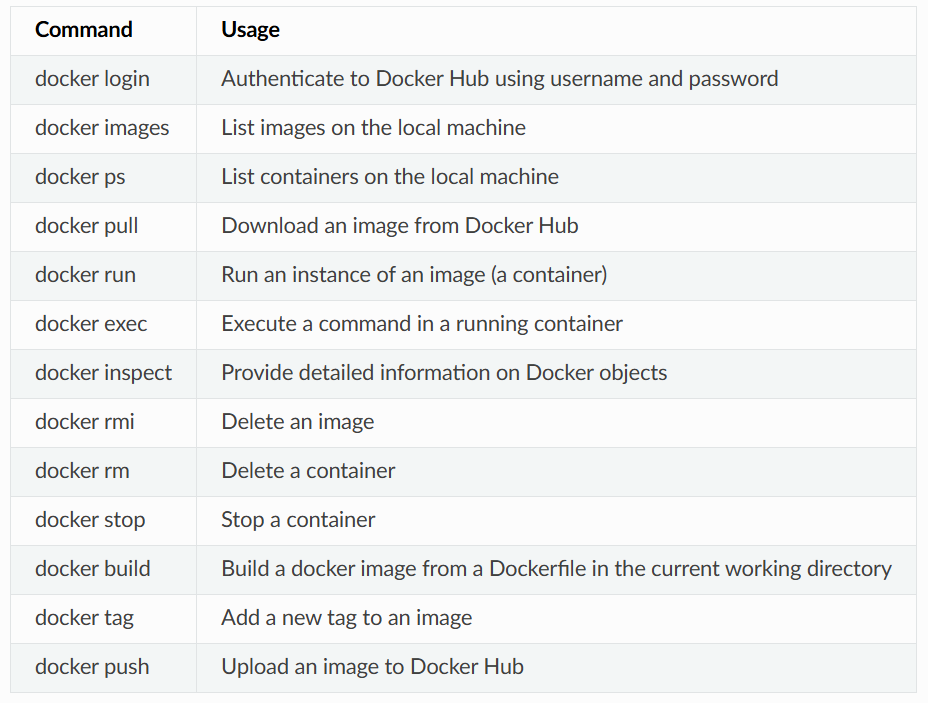

> https://containers-at-tacc.readthedocs.io/en/latest/index.html


## Introduction to containers

- VM vs Container
- Container tools: docker, apptainer (singularity)
- Dockerfile: recipe for creating a docker image
- Image: a blueprint for launching a container
- Container: an instance of image that can execute a software env.
- Image registry: dockerhub
- Image tags: `<owner>/<name>:<tag>` (e.g., `tacc/gateway19:v1`)

In summary, you pull the base docker image from dockerhub, add your custom recipe using dockerfile. Based on your dockerfile, you create docker image. You then use docker image to launch the container. 

## Getting started with docker

Show available images.

```bash
docker images
```

Pull image.

```bash
docker pull hello-world
```

Run image.

```bash
docker run hello-world

# Check if the pulled image is now available on your machine
docker images
```

```
REPOSITORY           TAG                 IMAGE ID       CREATED        SIZE
ubuntu               18.04               6ad7e71ba7d    2 days ago     63.2MB
hello-world          latest              feb5d9fea6a5   7 months ago   13.3kB
```

See current running containers.

```bash
docker ps
```

Inspect metadata for your image(s).

```bash
docker inspect <image>
```

Other core docker commands:



You can always get help from:

```bash
docker --help
docker COMMAND --help
```

## Working with Docker

> Be careful running container images that you are not familiar with. Some could contain security vulnerabilities or, even worse, malicious code like viruses or ransomware.
> 

To combat this, Docker Hub provides [“Official Images”](https://docs.docker.com/docker-hub/official_images/), a well-maintained set of container images providing high-quality installations of operating systems, programming language environments and more.

We can search through the official images on Docker Hub [here](https://hub.docker.com/search?image_filter=official&q=&type=image).

Let’ get python image

```bash
docker pull python
...
docker images
...
docker inspect python
...
```

Let’s run an interactive shell inside a container. Before that, let’s check the information of your machine. 

```bash
# See your identity of your local machine
whoami
yj

# pwd
pwd

# system info
uname -a
```

Now, start the interactive shell

```bash
docker run --rm -it python /bin/bash

# docker run       # run a container
# --rm             # remove the container when we exit
# -it              # interactively attach terminal to inside of container
# python           # use the official python image
# /bin/bash        # execute the bash shell program inside container
```

> `--rm` removes the container automatically when it stops.
> 
> 
> **What Happens if You Don’t Use** `--rm`**:**
> 
> 1. **Container Remains:** If you don't use `-rm`, the container will remain on your system in a stopped state after it completes its task. This allows you to inspect the container's files and logs even after it has stopped.
> 2. **Use Disk Space:** These stopped containers still take up disk space on your host machine.
> 3. **Manual Cleanup Required:** You would need to manually remove these containers to free up space and resources, using commands like:

> `-it` opens an interactive shell inside the container.
> 

Now, check your identity:

```
root@e5cfeaf40276:/# whoami
root
root@e5cfeaf40276:/# pwd
/
root@e5cfeaf40276:/# uname -a
Linux e5cfeaf40276 5.15.167.4-microsoft-standard-WSL2 #1 SMP Tue Nov 5 00:21:55 UTC 2024 x86_64 GNU/Linux
```

If you don’t want to open an interactive shell, but want to use commands,

```
docker run --rm python whoami
root

docker run --rm python pwd
/

docker run --rm python uname -a
Linux 8b1859f27f61 5.15.49-linuxkit-pr #1 SMP Thu May 25 07:17:40 UTC 2023 x86_64 GNU/Linux

docker run -it --rm python
Python 3.12.1 (main, Jan 17 2024, 06:18:08) [GCC 12.2.0] on linux
Type "help", "copyright", "credits" or "license" for more information.
>>>
```

The first three commands above omitted the `-it` flags because they did not require an interactive terminal to run. **On each of these commands, Docker finds the image the command refers to, spins up a new container** based on that image, executes the given command inside, prints the result, and exits and removes the container.

## Containerize your code

### Install code interactively

*Scenario:* You are a researcher who has developed some new code for a scientific application. You now want to distribute that code for others to use in what you know to be a stable production environment (including OS and dependency versions). End users may want to use this code on their local workstations, on an HPC cluster, or in the cloud.

```bash
cd ~/
mkdir python-container/
cd python-container/
touch Dockerfile
pwd
/Users/username/python-container/
ls
```

Make a random python file `pi.py` 

```python
# pi.py

#!/usr/bin/env python3
from random import random as r
from math import pow as p
from sys import argv

# Make sure number of attempts is given on command line
assert len(argv) == 2
attempts = int(argv[1])
inside = 0
tries = 0

# Try the specified number of random points
while (tries < attempts):
    tries += 1
    if (p(r(),2) + p(r(),2) < 1):
        inside += 1

# Compute and print a final ratio
print( f'Final pi estimate from {attempts} attempts = {4.*(inside/tries)}' )
```

See your files

```bash
pwd
/Users/username/python-container/
ls
Dockerfile     pi.py
```

Let’s start an interactive session. Consider a scenario where your code works for your local linux machine and want to containerize it. 

```bash
docker run -it -v $PWD:/code ubuntu:18.04 /bin/bash
```

It represents,

```
docker run      # run a container
-it             # interactively attach terminal to inside of container
-v $PWD:/code   # mount the current directory to /code
unbuntu:18.04   # image and tag from Docker Hub
/bin/bash       # shell to start inside container
```

If you don’t have `ubuntu:18.04`, docker will download the image from dockerhub. Then it will mount `$PWD$` to `/code` dir in the container ubuntu. 

Let’s update the ubuntu package manager `apt`.

```bash
apt-get update
...
apt-get upgrade
...
```

Install required packages

```bash
apt-get install python3
...
python3 --version
Python 3.6.9
```

Install and test your code

```bash
cd /code
chmod +rx pi.py  # make pi.py executable
export PATH=/code:$PATH  # Add `/code` to PATH to search for `pi,py`
```

Now, test the code.

```bash
cd /home
which pi.py
/code/pi.py
pi.py 1000000
```

```
Final pi estimate from 1000000 attempts = 3.142804
```

When you are done `exit` to exit container.

```
exit
```

### Build from a Dockerfile

```bash
FROM ubuntu:18.04

RUN apt-get update
# docker build process cannot handle interactive prompts, so we use the -y flag with apt.
RUN apt-get upgrade -y
RUN apt-get install -y python3
```

Each RUN instruction creates an intermediate image (called a ‘layer’). Too many layers makes the Docker image less performant, and makes building less efficient. We can minimize the number of layers by combining the RUN instructions:

```bash
**RUN** apt-get update && apt-get upgrade -y && apt-get install -y python3
```

Copy your files

```bash
COPY pi.py /code/pi.py
```

Full script:

```bash
# Base image
FROM ubuntu:18.04

# Install packages (minimize the number of `RUN`)
RUN apt-get update && apt-get upgrade -y && apt-get install -y python3

# Copy your file
COPY pi.py /code/pi.py

# Make the code executable
RUN chmod +rx /code/pi.py

# Add the project to PATH
ENV PATH="/code:$PATH"
```

Once the Dockerfile is ready, build an image

```bash
docker build -t username/code:version .
```

```bash
# -t: tag the image
# username: optional. preferably, it is dockerhub username
# .: indicates the location of Dockerfile
```

Build the image,

```bash
docker build -t username/pi-estimator:0.1 .
```

To change the docker image name,

```bash
docker tag old_image_name:new_tag new_image_name:new_tag
```

To remove the image,

```bash
docker rmi old_image_name:new_tag
```

To inspect image

```bash
docker inspect <username>/<imagename>:<tag>
```

Test the image

```bash
docker run --rm -it username/pi-estimator:0.1 /bin/bash

# docker run      # run a container
# --rm            # remove the container when we exit
# -it             # interactively attach terminal to inside of container
# username/...    # image and tag on local machine
# /bin/bash       # shell to start inside container
```

> Unlike the interactive image build, here, we don’t use `-v` to mound the code since we already `COPY` the code, so the code in already in the container.
> 

```bash
ls /code
pi.py
pi.py 1000000
```

```
Final pi estimate from 1000000 attempts = 3.137868
```

If we just want the result, not interactive shell session,

```bash
docker run --rm username/pi-estimator:0.1 pi.py 1000000
```

## Share Your Docker Image

### Commit to github

```bash
pwd
/Users/username/python-container/
ls
Dockerfile     pi.py
git init
git add *
git commit -m "first commit"
git remote add origin git@github.com:username/pi-estimator.git
git branch -M main
git push -u origin main
```

Let’s algo tag the repo as ‘0.1’ to match our docker image tag:

```bash
git tag -a 0.1 -m "first release"
git push origin 0.1
```

> Command: `git tag -a 0.1 -m "first release"`
> 
> 1. `git`: This is the main command for Git, the version control system.
> 2. `tag`: This is the Git subcommand used to create, list, delete, or verify tags.
> 3. `a 0.1`: This flag (`a`) specifies that you want to create an annotated tag with the name `0.1`. Annotated tags are stored as full objects in the Git database, containing the tagger name, email, date, and tagging message, along with the commit.
> 4. `m "first release"`: This flag (`m`) allows you to add a message to the tag, in this case, "first release." This message is stored in the tag object.
> 
> Command: `git push origin 0.1`
> 
> 1. `git`: The main Git command.
> 2. `push`: This is the Git subcommand used to upload local repository content to a remote repository.
> 3. `origin`: This is the default name for your remote repository (the place where your code is hosted remotely, such as GitHub, GitLab, or Bitbucket).
> 4. `0.1`: This is the name of the tag you created, which you are now pushing to the remote repository.
> 
> By combining these commands, you create an annotated tag to mark a specific point in your repository's history and then push that tag to your remote repository to share it with collaborators.
> 

### Push to docker hub

```bash
docker login
...
docker push username/pi-estimator:0.1
```

> Remember, the image must be name-spaced with either your Docker Hub username or a Docker Hub organization where you have write privileges in order to push it:
> 

### Hands-on Exercise

*Scenario:* You have the great idea to update your python code to use `argparse` to better handle the command line arguments. Outside of the container, modify `pi.py` to look like:

Update our `pi.py` . This change allows you to pass arg flags.

```python
#!/usr/bin/env python3
from random import random as r
from math import pow as p
from sys import argv

# Use argparse to take command line options and generate help text
import argparse
parser = argparse.ArgumentParser()
parser.add_argument("number", help="number of random points (int)", type=int)
args = parser.parse_args()

# Grab number of attempts from command line
attempts = args.number
inside = 0
tries = 0

# Try the specified number of random points
while (tries < attempts):
    tries += 1
    if (p(r(),2) + p(r(),2) < 1):
        inside += 1

# Compute and print a final ratio
print( f'Final pi estimate from {attempts} attempts = {4*(inside/tries)}' )
```

Correspondingly, update the Dockerfile for the container to consider the new updated functionality of the code.

```bash
FROM ubuntu:18.04

RUN apt-get update && apt-get upgrade -y && apt-get install -y python3

COPY pi.py /code/pi.py

RUN chmod +rx /code/pi.py

ENV PATH="/code:$PATH"

# Make container print the help for the `pi.py`
CMD ["pi.py", "-h"]
```

Rebuild the image and run.

```bash
docker build -t username/pi-estimator:0.2 .
docker run --rm username/pi-estimator:0.2 
```

> remember, `--rm` removes containers after it runs and stops.
> 

```
usage: pi.py [-h] number

positional arguments:
  number      number of random points (int)

optional arguments:
  -h, --help  show this help message and exit
```

If you want to run the code directly,

```bash
docker run --rm username/pi-estimator:0.2 pi.py 1000000
```

```
Final pi estimate from 1000000 attempts = 3.143672
```

If you want to run the code interactively,

```bash
docker run --rm -it username/pi-estimator:0.2 /bin/bash
which pi.py
# /code/pi.py

pi.py 1000000
# Final pi estimate from 1000000 attempts = 3.141168

exit
```

### Commit to Github

```bash
git add *
git commit -m "using argparse to parse args"
git push
git tag -a 0.2 -m "release version 0.2"
git push origin 0.2
```

### Other tips

Some miscellaneous tips for building images include:

- Save your Dockerfiles – GitHub is a good place for this
- You probably don’t want to use ENTRYPOINT - turns an container into a black box
- If you use CMD, make it print the help text for the containerized code
- Usually better to use COPY instead of ADD
- Order of operations in the Dockerfile is important; combine steps where possible
- Remove temporary and unnecessary files to keep images small
- Avoid using ‘latest’ tag; use explicit tag callouts
- The command `docker system prune` will help free up space in your local environment
- Use ‘docker-compose’ for multi-container pipelines and microservices
- A good rule of thumb is one tool or process per container

## Containers on HPC

For shared systems like HPC, Docker runtime is not secure. Apptainner is used instead of Docker. It is compatible with Docker containers. We provide a general guideline to use Apptainer with docker container. 

```bash
# Start interactive session
idev -m 40

# Load the apptainer module
module list

# Check how to load apptainer module
module spider apptainer

# As of 1/16/2025, `module spider apptainer` instruct you to do following
module load tacc-apptainer/1.3.3

# Check your loaded modules
module list
```

Core Apptainer commands

```bash
# Pull docker image
# If you would need to pull docker image like follows,
# `docker pull yjchoi9212/kratos-pfem-tacc:v0`
# You need you do following in apptainer
apptainer pull docker://<docker-image-name>:<tag>
```

This will make `.sif` file, which is essentially your apptainer container.

Interactive shell

```bash
apptainer shell lolcow_latest.sif
```

Run container

```bash
module load tacc-apptainer

apptainer run docker://godlovedc/lolcow:latest
```

To remove things,

```bash
# Remove a specific image
apptainer delete image_name.sif

# Alternative syntax
rm image_name.sif

```

To remove containers/instances:

```bash
bash
Copy
# List running instances first
apptainer instance list

# Stop a specific instance
apptainer instance stop instance_name

# Stop all running instances
apptainer instance stop --all

```

Important notes:

- Unlike Docker, Apptainer images are single files with `.sif` extension
- You can simply delete the .sif file to remove an image
- Apptainer doesn't store containers persistently like Docker does
- Instances (running containers) are automatically cleaned up when stopped
- There's no equivalent to Docker's dangling images or container cleanup